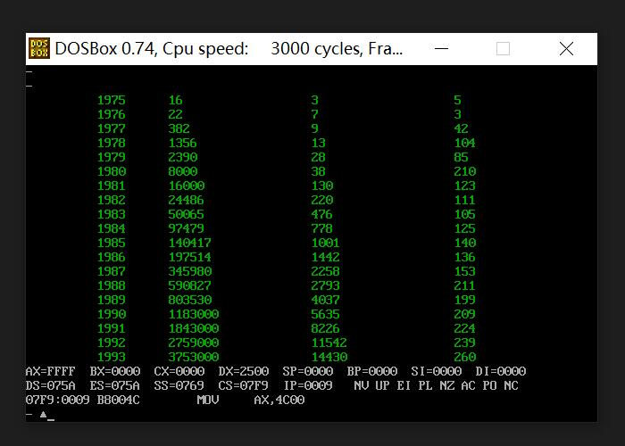

# Assembly's Two Part


## 第 7 章 更灵活的定位内存地址的方法


### 7.1 and 和 or 指令

- and 指令：逻辑与指令，按位进行与运算（两个同时为真，才为真；反之，有一个为假，就为假）

  ```
  mov al,01100011B
  and al,00111011B
  ;al =  00100011B
  ```

  

- or 指令：逻辑或指令，按位进行或运算（有一个为真，即是真；反之同时为假，就为假）

  ```
  mov al,01100011B
  or al, 00111011B
  ;al =  01111011B
  ```


#### 扩展： PHP 位运算的 ini 设置应用
> https://www.php.net/manual/zh/language.operators.bitwise.php


#### 扩展：PHP 位运算的业务应用

- 应用背景：用户三百万，用户字段，当时接近 100个，还在不断扩展；并发比较高，用户信息会同步 redis；在一些特定的场景下，

  会非常的方便数据库的扩展，会节省较多的缓存。

```php
<?php


class Binary
{


    public static $flag_shumei = 1; // 0001
    public static $flag_driver = 2; // 0010

    //判断这个标志位是否被设置
    public function isBitSetFlag($flag,$val)
    {
        return (($val & $flag) === $flag);
    }

    /**
     * Notes: 设置标志位
     * User: ${USER}
     * Date: ${DATE}
     * Time: ${TIME}
     * @param $flag
     * @param $val
     * @param $bool
     * @return mixed
     *
     */
    public function setBitflag($flag,$val,$bool)
    {
        if($bool){
            $val |= $flag;
        }else{
            $flag ^= $flag;
            $val &= $flag;
        }

        return $val;
    }

  
    //初始化二进制的值
    public function initValueBinary()
    {
        return 0;
    }

}


class Activity
{

    /**
     * Notes: 设置二进制位
     * User: ${USER}
     * Date: ${DATE}
     * Time: ${TIME}
     * @param $data
     * bool,如果设置为开启，则为true ；如果设置为关闭，则为 false;
     */
    public function userBinaryCharacter($data)
    {

        $uid = $data['uid'];
        $type = $data['type'];
        $bool = $data['bool'];
        ## 更新和写入
        $model = new UserBinaryCharacter();
        $res = $model->find()->where(['uid'=>$uid])->asArray()->one();
        $cur_time = date('Y-m-d H:i:s');
        if($res){
            $binary_one = $res['binary_one'];
            //设置二进制位
            $binary_one = UserDAO::getInstance()->setBitflag($type,$binary_one,$bool);
            $data = [
                'binary_one' => $binary_one,
                'update_time' => $cur_time
            ];
            //数据库的更新操作
            if($model::updateAll($data, ['uid'=>$uid])){
                //更新redis
                UserDAO::getInstance()->updateRedisUserInfo($uid,$data);
            };

        }else{
            $binary_one = UserDAO::getInstance()->initValueBinary();
            $binary_one = UserDAO::getInstance()->setBitflag($type,$binary_one,$bool);
            //数据库的写入操作
            $model->uid = $uid;
            $model->binary_one = $binary_one;
            $model->create_time = $cur_time;
            $model->update_time = $cur_time;
            if($model->save()){
                //更新redis
                $data = [
                    'binary_one' => $binary_one,
                    'update_time' => $cur_time
                ];
                UserDAO::getInstance()->updateRedisUserInfo($uid,$data);
            };
        }

    }

    public function judgeUserBinaryCharacter($data)
    {

        $uid = $data['uid'];
        $type = $data['type'];
        $user_info = UserDAO::getInstance()->getUserInfoByUid($uid);
        $bool = false;
        if(isset($user_info['binary_one']) && (UserDAO::getInstance()->isBitSetFlag($type,$user_info['binary_one']))){
            $bool = true;
        }
        return $bool;
    }
  
  
  
}


?>
```


### 7.2 关于 ASCII 码

- 计算机只保存二进制，人类比较喜欢字符串。例如，宝马雕车香满路，一夜鱼龙舞，多么的具象；例如 "a",保存在计算机中是 61H,

  输出到显存，显示部分将 61H 转为 “a” 展示在屏幕上。故，ASCII码更像是一个翻译家，是一个沟通的桥梁。

- 世界上有很多的编码方案，计算机系统中，通常采用 ACSCII 码。（这里的计算机系统应该比较老哈～）


#### 扩展：字符串和编码

> https://www.liaoxuefeng.com/wiki/1016959663602400/1017075323632896

> 由于计算机是美国人发明的，因此，最早只有127个字符被编码到计算机里，也就是大小写英文字母、数字和一些符号，这个编码表被称为`ASCII`编码
>
> 但是要处理中文显然一个字节是不够的，至少需要两个字节，而且还不能和ASCII编码冲突，所以，中国制定了`GB2312`编码，用来把中文编进去。
>
> 你可以想得到的是，全世界有上百种语言，日本把日文编到`Shift_JIS`里，韩国把韩文编到`Euc-kr`里，各国有各国的标准，就会不可避免地出现冲突，结果就是，在多语言混合的文本中，显示出来会有乱码。
>
> 因此，Unicode字符集应运而生。Unicode把所有语言都统一到一套编码里，这样就不会再有乱码问题了。
>
> Unicode标准也在不断发展，但最常用的是UCS-16编码，用两个字节表示一个字符（如果要用到非常偏僻的字符，就需要4个字节）。现代操作系统和大多数编程语言都直接支持Unicode。
>
> 在计算机内存中，统一使用Unicode编码，当需要保存到硬盘或者需要传输的时候，就转换为UTF-8编码。
>
> ...


### 7.3 以字符形式给出的数据

- 代码示下：

  ```assembly
  assume cs:code,ds:data
  
  data segment
      db 'unIX'    ;在内存单元中，一个字符串占用一个内存单元
      db 'foRK'
  data ends
  
  code segment
  			
  start:  
      mov ax,data
      mov ds, ax    ;仅仅是查看，我为啥写这个赋值呢？方便明确的查看段地址，来 debug 数据哈
                    ;例如："ds=0B2D",所以程序从 0B3D 段开始~ 难道这就是 PSP，暂不深究啦~
      
      mov al,'a'
      mov bl,'b'
  
      mov ax,4c00h
      int 21h
  
  
  code ends
  
  
  end start
  ```


### 7.4 大小写转换的问题

- 如下所示：将 data 段中的第一个字符串 “BaSiC” 转化为大写，第二个字符串 “iNfOrMaTioN” 转化为小写：

  ```assembly
  assume cs:code,ds:data
  
  data segment
      db 'BaSiC'
      db 'iNfOrMaTioN'
  data ends
  
  code segment
  			
  start:  
      
      mov ax,4c00h
      int 21h
  
  
  code ends
  
  
  
  end start
  ```

  

- 代码示下：

  ```assembly
  assume cs:code,ds:data
    
      data segment
          db 'BaSiC'
          db 'iNfOrMaTioN'
      data ends
    
      code segment
    			
      start:  
          
          mov ax,data
          mov ds,ax
          mov bx,0
  
          mov cx,5
      s1: 
          mov al,[bx]
          and al,11011111B
          mov [bx],al
          inc bx
      loop s1
  
          mov cx,0bh
      s2:
          mov al,[bx]
          or al,00100000B
          mov [bx],al
          inc bx
      loop s2
  
          mov ax,4c00h
          int 21h
      
    
    code ends
    
    
    
    end start
  ```

  

### 7.5 [bx+idata]

```
;mov ax,[bx+200] 的含义
;数学化的描述为： (ax) = ((ds)*16 + (bx) + 200)

;还可以写成以下三种格式：
; 经测试，这三种格式，在 debug 和 源程序中，都是可以的
; debug 中，-a 输入命令，所有的数据默认就是 16 进制，暂认为没有其它进制
; 源程序中，默认就是十进制，带上 h 表示 16 进制

mov ax,[bx+0c8h]
mov ax,0c8h[bx]
mov ax,[bx].0c8h
```


### 7.6 用 [bx+idata] 的方式进行数组的处理

- 如下所示：将 data 段中的第一个字符串 “BaSiC” 转化为大写，第二个字符串 “MinIx” 转化为小写：

  ```assembly
  assume cs:code,ds:data
  
  data segment
      db 'BaSiC'
      db 'MinIx'
  data ends
  
  code segment
  			
  start:  
      
      mov ax,4c00h
      int 21h
  
  
  code ends
  
  
  end start
  ```

- 根据上面的例子，稍加修改，代码如下：

  ```
  assume cs:code,ds:data
    
      data segment
          db 'BaSiC'
          db 'MinIX'
      data ends
    
      code segment
    			
      start:  
          
          mov ax,data
          mov ds,ax
          mov bx,0
  
          mov cx,5h
      s1: 
          mov al,[bx]
          and al,11011111B
          mov [bx],al
          inc bx
      loop s1
  
          mov cx,5h
      s2:
          mov al,[bx]
          or al,00100000B
          mov [bx],al
          inc bx
      loop s2
  
          mov ax,4c00h
          int 21h
      
    
    code ends
    
    
    end start
  ```

  

- 用 [bx+idata] 的方式，优化如下：

  ```assembly
  assume cs:code,ds:data
    
      data segment
          db 'BaSiC'
          db 'MinIX'
      data ends
    
      code segment
    			
      start:  
          
          mov ax,data
          mov ds,ax
          mov bx,0
  
          mov cx,5h
      s1: 
          mov al,0[bx]
          and al,11011111B
          mov 0[bx],al
  
          mov al,5[bx]
          or al,00100000B
          mov 5[bx],al
  
          inc bx
      loop s1
  
      
  
          mov ax,4c00h
          int 21h
      
    
    code ends
    
    
    end start
  ```

- C 语言的原生实现

     ```c
     #include <stdio.h>
       
     int main()
     {
     
             char a[] = "BaSiC";
             char b[] = "MinIX";
     
             int i=0;
             do{
                     a[i]=a[i] & 0b11011111;
                     b[i]=b[i] | 0b00100000;
                     i++;
             }while(i<5);
     
             printf("%s",a);
             printf("%s",b);
     
     }
     
     ```


- Php 语言的原生实现

  ```php
  <?php
  
  
          $a = 'BaSic';
          $b = 'MinIX';
  
          do{
                  $a[$i] &= 0b11011111;
                  $b[$i] |= 0b00100000;
                  $i++;
  
          }while($i<5);
  
  
          var_dump($a);
          var_dump($b);
  
  ```

  ```
  Fatal error: Uncaught Error: Cannot use assign-op operators with string offsets in /home/ch/php/test001.php:8
  Stack trace:
  #0 {main}
    thrown in /home/ch/php/test001.php on line 8
  
  ```

 

#### [bx+idata] 和高级语言数组的关系

```
C 语言:    a[i],b[i]
汇编语言:   0[bx],5[bx] 
```

- 可以看出，[bx+idata] 的方式为高级语言实现数组提供了便利机制。


### 7.7 SI 和 DI

- si 和 di 是 8086CPU 中和 bx 功能相近的寄存器，si 和 di 不能够分为两个 8 位寄存器来使用

#### 问题 7.2 ：用 si 和 di 实现将字符串 'welcome to masm!' 复制到它后面的数据区中

```assembly
assume cs:code,ds:data
  
    data segment
        db 'welcome to masm!'
        db '................'
    data ends
  
    code segment
  			
    start:  
        
        
        mov ax,4c00h
        int 21h
    
  
  code ends
  
  
  end start
```


- 解答：

```assembly
assume cs:code,ds:data
  
    data segment
        db 'welcome to masm!'
        db '................'
    data ends
  
    code segment
  			
    start:  
        mov ax,data
        mov ds,ax
        mov di,0h

        mov cx,8h
    s1: 
        mov ax,[di]
        mov 10h[di],ax
        add di,2
    loop s1
        
        mov ax,4c00h
        int 21h
    
  
  code ends
  
  
  end start
```


### 7.8 [bx+si] 和 [bx+di]

- 指令 mov ax,[bx+si] 的含义如下：(ax) = ((ds)*16 +(bx)+(di)) ; 也可以表示为 

  ```assembly
  mov ax,[bx][si]
  ```

  

- 一个特别小的注意点分享哈，有时特别容易懵

```asseembly
;Debug 查看内存，结果如下：
;2000:0000 BE 00 06 00 00 00 ...
;((2000*16) + 0000) 等于 00BE 还是  00EB ？
; 结果是 00BE 哈
; 在内存中 00 相对 BE 是高位，在寄存器中，将寄存器表达出来， B 相对于 E 是高位哦~
```


### 7.9 [bx+si+idata] 和 [bx+di+idata]

- 指令 mov ax,[bx+si+idata] 的含义如下：(ax) = ((ds)*16+(bx)+(si)+(idata));也可以表示为：

  ```assembly
  mov ax,[bx+200+si]
  mov ax,[200+bx+si]
  mov ax,200[bx][si]
  mov ax,[bx].200[si]
  mov ax,[bx][si].200
  ```

  

### 7.10 不同的寻址方式的灵活应用

- 通过一个问题的系列来体会 CPU 提供多种寻址方式的用意

#### 编程，将 datasg 段中的每个单词的头一个字母改为大写字母

```assembly
assume cs:codesg,ds:datasg
  
    datasg segment
        db '1. file         '
        db '2. edit         '
        db '2. search       '
        db '2. view         '
        db '2. options      '
        db '2. help         '
    datasg ends
  
    codesg segment
  			
    start:  
        

        mov ax,4c00h
        int 21h
    
  
  codesg ends
  
  
  end start
```


- Answer

```assembly
assume cs:codesg,ds:datasg
  
    datasg segment
        db '1. file         '
        db '2. edit         '
        db '2. search       '
        db '2. view         '
        db '2. options      '
        db '2. help         '
    datasg ends
  
    codesg segment
  			
    start:  
        mov ax,datasg
        mov ds,ax
        mov bx,0h
        mov cx,6h
        
    s1:
        mov ah,3[bx]
        and ah,11011111B
        mov 3[bx],ah
        add bx,10h
    loop s1        

        mov ax,4c00h
        int 21h
    
  
  codesg ends
  
  
  end start
```


#### 问题7.7：编程，将 datasg 段中每个单词改为大写字母

```assembly

assume cs:codesg,ds:datasg
  
    datasg segment
        db 'ibm             '
        db 'dec             '
        db 'dos             '
        db 'vax             '
    datasg ends
  
    codesg segment
  			
    start:

        mov ax,4c00h
        int 21h
    

    codesg ends
  end start
```

- 解答一，这种循环方式不够好

```assembly
assume cs:codesg,ds:datasg
  
    datasg segment
        db 'ibm             '
        db 'dec             '
        db 'dos             '
        db 'vax             '
    datasg ends
  
    codesg segment
  			
    start:  
        mov ax,datasg
        mov ds,ax
        mov bx,0h
        
        mov si,0h
        mov cx,3h
        mov ds:[40h],cx

    s0:
        mov cx,4h
    s1:
        mov ah,[bx+si]
        and ah,11011111B
        mov [bx+si],ah
        add bx,10h
    loop s1        

        sub bx,40h
        inc si
        mov cx,ds:[40h]
        sub cx,si
        inc cx

    loop s0


        mov ax,4c00h
        int 21h
    

    codesg ends

  end start

```


- 解答二：一列操作完成，再到另外一列，这种循环方式，比较高效一些

```assembly

assume cs:codesg,ds:datasg
  
    datasg segment
        db 'ibm             '
        db 'dec             '
        db 'dos             '
        db 'vax             '
    datasg ends
  
    codesg segment
  			
    start:  
        mov ax,datasg
        mov ds,ax

        mov bx,0
        mov cx,4h
        
    s1:
        mov ds:[400h],cx
        mov si,0
        mov cx,3h
    s2:
        mov ah,[bx+si]
        and ah,11011111B
        mov [bx+si],ah
        inc si
    loop s2

        add bx,10h
        mov cx,ds:[400h]
    loop s1


    mov ax,4c00h
    int 21h
    

    codesg ends

  end start


```

- 解答三，使用栈

```assembly
assume cs:codesg,ds:datasg,ss:stacksg
  
    datasg segment
        db 'ibm             '
        db 'dec             '
        db 'dos             '
        db 'vax             '
    datasg ends
  
    stacksg segment    ;定义一个栈段，容量为 16 字节

        db '0,0,0,0,0,0,0,0,0,0,0,0,0,0,0,0,'
    stacksg ends


    codesg segment
  			
    start:  
        mov ax,datasg
        mov ds,ax
        mov ax,stacksg
        mov ss,ax

        mov bx,0
        mov cx,4h
        
    s1:
        push cx
        mov si,0
        mov cx,3h
    s2:
        mov ah,[bx+si]
        and ah,11011111B
        mov [bx+si],ah
        inc si
    loop s2

        add bx,10h
        pop cx
    loop s1    ;loop 指令很是相当于高级语言中的 do{}while()


    mov ax,4c00h
    int 21h
    

    codesg ends

  end start

```


#### 问题 7.9：编程，将 datasg 段中的每个单词的前 4 个字母改为大写字母

```assembly
assume cs:codesg,ds:datasg,ss:stacksg
  
    datasg segment
        db '1. display      '
        db '2. brows        '
        db '3. replace      '
        db '4. modify       '
    datasg ends
  
    stacksg segment    ;定义一个栈段，容量为 16 字节

        db '0,0,0,0,0,0,0,0,0,0,0,0,0,0,0,0,'
    stacksg ends


    codesg segment		
    start:  
        


    mov ax,4c00h
    int 21h
    

    codesg ends

  end start

```

- The answer

```assembly
assume cs:codesg,ds:datasg,ss:stacksg
  
    datasg segment
        db '1. display      '
        db '2. brows        '
        db '3. replace      '
        db '4. modify       '
    datasg ends
  
    stacksg segment    ;定义一个栈段，容量为 16 字节

        db '0,0,0,0,0,0,0,0,0,0,0,0,0,0,0,0,'
    stacksg ends


    codesg segment
    start:  
        mov ax,datasg
        mov ds,ax
        mov ax,stacksg
        mov ss,ax

        mov bx,3
        mov cx,4h
        
    s1:
        push cx
        mov si,0
        mov cx,4h
    s2:
        mov ah,[bx+si]
        and ah,11011111B
        mov [bx+si],ah
        inc si
    loop s2

        add bx,10h
        pop cx
    loop s1


    mov ax,4c00h
    int 21h
    

    codesg ends

  end start

```

我在这里，测试一下，是不是一定要 assume 等定义才行

```assembly
assume cs:codesg
  
    datasg segment
        db '1. display      '
        db '2. brows        '
        db '3. replace      '
        db '4. modify       '
    datasg ends
  
    stacksg segment    ;定义一个栈段，容量为 16 字节

        db '0,0,0,0,0,0,0,0,0,0,0,0,0,0,0,0,'
    stacksg ends


    codesg segment
    start:  
        mov ax,datasg
        mov ds,ax
        mov ax,stacksg
        mov ss,ax

        mov bx,3
        mov cx,4h
        
    s1:
        push cx
        mov si,0
        mov cx,4h
    s2:
        mov ah,[bx+si]
        and ah,11011111B
        mov [bx+si],ah
        inc si
    loop s2

        add bx,10h
        pop cx
    loop s1

    mov ax,4c00h
    int 21h
    
    codesg ends

  end start
```

-- Success

```assembly
assume cs:codesg,ss:stacksg
  
    datasg segment
        db '1. display      '
        db '2. brows        '
        db '3. replace      '
        db '4. modify       '
    datasg ends
  
    codesg segment
    start:  
        mov ax,datasg
        mov ds,ax
        mov ax,stacksg
        mov ss,ax

        mov bx,3
        mov cx,4h
        
    s1:
        push cx
        mov si,0
        mov cx,4h
    s2:
        mov ah,[bx+si]
        and ah,11011111B
        mov [bx+si],ah
        inc si
    loop s2

        add bx,10h
        pop cx
    loop s1

    mov ax,4c00h
    int 21h
    
    codesg ends

  end start
```

-- Fail (Symbol not defined: STACKSG)

```assembly
    datasg segment
        db '1. display      '
        db '2. brows        '
        db '3. replace      '
        db '4. modify       '
    datasg ends
  
    stacksg segment    ;定义一个栈段，容量为 16 字节

        db '0,0,0,0,0,0,0,0,0,0,0,0,0,0,0,0,'
    stacksg ends

    codesg segment
    start:  
        mov ax,datasg
        mov ds,ax
        mov ax,stacksg
        mov ss,ax

        mov bx,3
        mov cx,4h
        
    s1:
        push cx
        mov si,0
        mov cx,4h
    s2:
        mov ah,[bx+si]
        and ah,11011111B
        mov [bx+si],ah
        inc si
    loop s2

        add bx,10h
        pop cx
    loop s1

    mov ax,4c00h
    int 21h
    
  codesg ends
  end start
```

-- Failed (Missing or unreachable: CS)


## 第八章 数据处理的两个问题

### 两个基本问题

1. 处理的数据在什么地方？

2. 要处理的数据有多长？

- 虽然讨论在 8086CPU 上进行，但是这两个基本问题却是普遍的，对任何一个处理机都存在
- sreg 的集合包括：ds,ss,cs,es
- reg 的集合包括：ax, bx, cx, dx, ah, al, bh, bl, ch, cl, dh, dl, sp, bp, si, di


### 8.1 bx,si,di 和 bp

- bp 也可以用来表示偏移地址，默认的段地址为 ss; bx,si,di 的段地址默认为 ds.

- 列举几个合法的例子：

  ```assembly
  mov ax,[si]    ;
  mov ax,[di]    ;
  ```

  

- 列举典型的错误示例

  ```assembly
  mov ax,[bx+bp]    ;
  mov ax,[si+di]    ;
  mov ax,[bx]    ;
  ```


### 8.2 机器指令处理的数据在什么地方

- 内存中
- 寄存器中
- 指令缓冲器中
- 端口

### 8.3 汇编语言中数据位置的表达

1. 立即数[idata]
2. 寄存器
3. 段地址(SA) 和偏移地址(EA)

### 8.4 寻址方式

1. 直接寻址
2. 寄存器间接寻址
3. 寄存器相对寻址
4. 基址变址寻址
5. 相对基址变址寻址

### 8.5 指令要处理的数据有多长

1. 通过寄存器来指定

2. 用操作符 X ptr 指明内存单元的长度

3. 其它方法，比如 push 指令只进行字操作

    ```assembly
   assume cs:codesg,ds:datasg,ss:stacksg
       
       datasg segment
           db '1. display      '
           db '2. brows        '
           db '3. replace      '
           db '4. modify       '
       datasg ends
       
       stacksg segment    ;定义一个栈段，容量为 16 字节
   
           db '0,0,0,0,0,0,0,0,0,0,0,0,0,0,0,0,'
       stacksg ends
      
       codesg segment
       start:  
           mov ax,datasg
           mov ds,ax
           inc byte ptr ds:[0]    ; 成功
           push ds:[0]    ; push，pop 的操作单位是 字，且可以直接操作内存，普通寄存器，段寄存器
           pop ds    ; 成功,结果为 2E32h
           push ds
           
       mov ax,4c00h
       int 21h
   
       codesg ends
       end start
   ```

   

### 8.6 寻址方式的综合应用

#### 示例：关于 DEC 公司的一条记录 (1982 年)如下：

|  表头   | 表头  |
|  ----  | ----  |
| 公司名称 | DEC |
| 总裁姓名 | Ken Olsen |
| 排名 | 137 |
| 收入 | 40(40 亿美元) |
| 产品 | PDP(小型机) |

#### 1988 年，公司信息有了如下变化

- 排名升至 38
- 收入增加了 70 亿美元
- 产品更新为 VAX 系列计算机

#### 代码实现

- 汇编实现

  ```assembly
  assume cs:codesg,ds:datasg
    
      datasg segment
          db 'DEC'
          db 'Ken Oslen'
          dw 137
          dw 40
          db 'PDP'
      datasg ends
    
      codesg segment
      start:  
  
          mov ax,datasg
          mov ds,ax
          mov bx,0
          
          mov word ptr [bx].0ch,50h
          add word ptr [bx].0eh,46h
          mov si,0h
          mov byte ptr [bx].10h[si],'V'    ;一般 bx 定义整个结构体，idata 定义结构体中的某一个数据项
                                           ; si 定位数组项中的每个元素
          inc si
          mov byte ptr [bx].10h[si],'A'
          inc si
          mov byte ptr [bx].10h[si],'X'
  
  
      mov ax,4c00h
      int 21h
  
      codesg ends
    end start
  
  ```

  

- C 实现

  ```c
  #include <stdio.h>
    
  struct Company
  {
          char company_name[16];    //公司名称
          char ceo_name[16];    //总裁姓名
          int rank;    // 排名
          int income;    // 收入
          char famous_product[16];    //著名的产品
  
  };
  
  struct Company company = {"DEC", "Ken Olsen", 137, 40, "PDP"};
  void printCompany( struct Company company);
  
  int main()
  {
          int i;
          company.rank = 38;
          company.income = company.income + 70;
          i = 0;
          company.famous_product[i] = 'V';    // 和汇编程序，有着很大的相似之处
          i++;
          company.famous_product[i] = 'A';
          i++;
          company.famous_product[i] = 'V';
  
          printCompany( company );
  
          return 0;
  
  }
  
  void printCompany( struct Company company )
  {
          printf("company name : %s\n", company.company_name);
          printf("company ceo name : %s\n", company.ceo_name);
          printf("company rank : %d\n", company.rank);
          printf("company income : %d\n", company.income);
          printf("company famous product : %s\n", company.famous_product);
  
  }
  
  ```

  

### 8.7 div 指令

#### 编程：计算 100001/100

- 16 进制表示

```assembly
assume cs:codesg,ds:datasg
  
    datasg segment
        
    datasg ends
  
    codesg segment
    start:  
        mov dx,1h
        mov ax,86A1h
        mov bx,64h
        div bx
                          ; 结果是 (ax) = 03E8h, (dx) = 0001h 

        
    mov ax,4c00h
    int 21h

    codesg ends   
 end start

```


- 10 进制表示

```assembly
assume cs:codesg,ds:datasg
  
    datasg segment
        
    datasg ends
  
    codesg segment
    start:  
        mov dx,1
        mov ax,34465
        mov bx,100
        div bx

        
    mov ax,4c00h
    int 21h

    codesg ends

end start

```


#### 编程：计算 1001/100


- 16 进制代码

  ```assembly
  assume cs:codesg,ds:datasg
    
      datasg segment
          
      datasg ends
    
      codesg segment
      start:  
          mov ax,03E9h    ; 经测试，03e9h,小写的 e 也是可以的哦。Windows 平台应该不区分大小写吧
          mov bl,64h
          div bl
  						; 结果 (ax) = 010Ah
          
      mov ax,4c00h
      int 21h
  
      codesg ends
  
  end start
  
  ```


- 10 进制代码

  ```assembly
  assume cs:codesg,ds:datasg
    
      datasg segment
          
      datasg ends
    
      codesg segment
      start:  
          mov ax,1001
          mov bl,100
          div bl
  
          
      mov ax,4c00h
      int 21h
  
      codesg ends
  
  end start
  
  ```

  

### 8.8 伪指令 dd

- Means double word

  ```assembly
  datasg segment
      db 1    ; 占用一个字节 01h
      dw 1    ; 占用两个字节 0001h
      dd 1    ; 占用四个字节 00000001h
  datasg ends
  ```

#### 再次讲解 1byte = 8bit 1KB = 1024Byte 1MB = 1024KB 1GB = 1024MB

- 一根导线，可以表示数据  0~1；两根导线，可以表示 0~3；三根导线，可以表示数据 0~7；

  四根导线，可以表示数据 0~15，即 一个16 进制的数据等同于四根导线；

- 8086CPU的寄存器是16位（16根导线），可以表示的数据为 0~FFFFh,即 0~65535 （16 进制的数据和16 位的寄存器，记得区分哦）

- 一个内存单元是 1 byte, 8bit 表示 8 根导线，可以表示的数据为 0~FFh, 即 0~255  

- 32 位的地址总线最大的寻址是 2^32 byte = 4G 

  

### 8.9 伪指令 dup

#### dup 配合 db,dw,dd 来使用

```assembly
db 3 dup (0)    ; 定义了三个字节，00h,00h,00h
db 3 dup (0,1,2)    ; 定义了九个字节，00h,01h,02h,00h,01h,02h,00h,01h,02h

```


### 实验 7 寻址方式在结构化数据访问中的应用

#### 代码实现如下：

```assembly
assume cs:codesg,ds:datasg,ss:stacksg
  
    datasg segment
        ; 年份
        db '1975','1976','1977','1978','1979','1980','1981','1982','1983'
        db '1984','1985','1986','1987','1988','1989','1990','1991','1992'
        db '1993','1994','1995'

        ; 总收入
        dd 16,22,382,1356,2390,8000,16000,24486,50065,97479,140417,197514
        dd 345980,590827,803530,1183000,1843000,2759000,3753000,4649000,5937000

        ; 雇员数
        dw 3,7,9,13,28,38,130,220,476,778,1001,1442,2258,2793,4037,5635,8226
        dw 11542,14430,15257,17800

    datasg ends
  
    tablesg segment
        ; 人均收入，需要计算出来的数据
        db 21 dup ('year summ dp ?? ')
    tablesg ends

    stacksg segment
        db 16 dup (0h)
    stacksg ends

    codesg segment
    start:  
        mov ax,datasg
        mov ds,ax
        mov ax,tablesg
        mov es,ax
        
        mov bx,0
        mov bp,0
        mov si,0
        mov di,0
        
        mov cx,21
    s0:
        ; 赋值总收入
        mov ax,[bx]
        mov es:[bp],ax    ; 如果没有使用默认的寄存器，会多一个指令，占用一个字节的。至于原因，暂且不知
        add bx,2h
        add bp,2h
        mov ax,[bx]
        mov es:[bp],ax


        add bp,2h    ;内存地址向前移动两位
        inc bp       ;有一个空格，内存地址向前移动一位

        ; 赋值收益总数
        mov ax,ds:54h[si]
        mov es:[bp],ax
        push ax
        add si,2h
        add bp,2h
        mov ax,ds:54h[si]
        mov es:[bp],ax
        mov dx,ax

        add bp,2h    ;内存地址向前移动两位
        inc bp       ;有一个空格，内存地址向前移动一位
        
        ; 雇员数
        mov ax,ds:0A8h[di]
        mov es:[bp],ax

        add bp,2h    ;内存地址向前移动两位
        inc bp       ;有一个空格，内存地址向前移动一位

        ; 赋值平均数
        pop ax
        div word ptr ds:0A8h[di]
        mov es:[bp],ax

        add bp,2h    ;内存地址向前移动两位
        inc bp       ;有一个空格，内存地址向前移动一位

        add bx,2h
        add di,2h
        add si,2h

    loop s0
        
    mov ax,4c00h
    int 21h

    codesg ends   
 end start

```


## 第九章 转移指令的原理

- 可以修改 IP，或同时修改 CS 和 IP 的指令统称为转移指令


### 9.1 操作符 offset

操作符 offset 在汇编语言中是由编译器处理的符号，它的功能是取得标号的偏移地址


### 9.2 jmp 指令

jmp 为无条件转移指令，可以只修改 IP，也可以同时修改 CS 和 IP

不同的给出目的地址的方法，和不同的转移位置，对应有不同的 jmp 指令


### 9.3 转移的目的地址在指令中的 jmp 指令

1. jmp short 标号
2. jmp near ptr 标号

具体的计算涉及到补码（附注 2）


### 9.4 转移的目的地址在指令中的 jmp 指令

“jmp far ptr 标号 ” 实现的是段间转移，又称为远转移

### 附注 3 汇编编译器（masm.exe) 对 jmp 的相关处理

#### 向前转移

1. 如果 disp 属于 [-128,127],  汇编代码

   ```assembly
   assume cs:codesg
   
   codesg segment
   start: 
   
   s:
       jmp s
       jmp short s
       jmp near ptr s
       jmp far ptr s
   
       mov ax, 4c00h
       int 21h
    
   codesg ends
   end start
   ```

   反汇编查看，分别对应着：

   ```assembly
   EBFE ; -2
   EBFC ; -4
   EBFA ; -6
   EBF8 ; -8
   ```

2. 如果 disp 属于 [-32768,32767],  汇编查看

   ```assembly
   assume cs:codesg
   
   codesg segment
   start: 
   
   s:
       db 100 dup (0b8h, 0, 0)
       jmp s
       jmp near ptr s
       jmp far ptr s
   
       mov ax, 4c00h
       int 21h
    
   codesg ends
   end start
   ```

   反汇编查看 (-u 076a:0120)，分别对应着：

   ```assembly
   E9D1FE ; 一起占用三个字节，偏移的距离占用了两个字节，可以看出这是一个负数
   E9CEFE ; 一起占用三个字节，偏移的距离占用了两个字节，可以看出这是一个负数
   EA00006A07 ; 一起占用五个字节，偏移的距离占用了四个字节，一个是段地址，一个是偏移地址
   ```

#### 向后转移

1. 如果 disp 属于 [-128,127],  汇编代码

   ```assembly
   assume cs:codesg
   
   codesg segment
   start: 
       jmp short s
       jmp s
       jmp near ptr s
       jmp far ptr s
   s:
       mov ax, 0
   
       mov ax, 4c00h
       int 21h
    
   codesg ends
   end start
   ```

   反汇编查看：

   ```assembly
   EB0B ; 可以看出这是正数
   EB09 ; 
   90 ; NOP
   EB06 ;
   90 ; NOP
   EB03 ; 可以看出这是偏移三个字节。一起将占用五个字节，EB 占用一个字节，距离占用一个字节，留空三个字节
   90 ; NOP
   90 ; NOP
   90 ; NOP
   ```

2. 如果 disp 属于 [-32768,32767],  汇编代码

   ```assembly
   assume cs:codesg
   
   codesg segment
   start: 
       jmp s
       jmp near ptr s
       jmp far ptr s
       db 100 dup (0b8h, 0, 0)
   s:
       mov ax, 0
   
       mov ax, 4c00h
       int 21h
    
   codesg ends
   end start
   ```

   反汇编查看：

   ```assembly
   E93401 ; JMP 0137
   E93101 ; JMP 0137
   EA37016A07 ; JMP 076A:0137
   ```

   

### 9.5 转移地址在寄存器中的 jmp 指令

指令格式： jmp 16-reg

功能：（IP）=（16-reg）


### 9.6 转移地址在内存中的 jmp 指令

转移地址在内存中的 jmp 指令有两种格式：

1.  jmp word ptr 内存单元地址（设置 IP，段内转移）
2.  jmp dword ptr 内存单元地址（高位地址设置 CS，低位地址设置 IP，段间转移）


#### 习题1

```assembly
assume cs:codesg,ds:datasg
  
    datasg segment
        db 0,0
    datasg ends
  
    codesg segment
    start:  
        mov ax,datasg
        mov ds,ax
        mov bx,0
        jmp word ptr [bx+1]
        
    mov ax,4c00h
    int 21h

    codesg ends

end start
```


#### 习题2

```assembly
assume cs:codesg,ds:datasg
  
    datasg segment
        dd 12345678H
    datasg ends
  
    codesg segment
    start:  
        mov ax,datasg
        mov ds,ax
        mov bx,0
        mov [bx],bx
        mov [bx+2],cs
        jmp dword ptr ds:[0]
        
    mov ax,4c00h
    int 21h

    codesg ends

end start
```


### 9.7 jcxz 指令

“jcxz 标号” 的功能相当于： if ((cx) == 0) jmp short 标号；

jcxz 指令为有条件转移指令，所有的有条件转移指令都是短转移


习题：利用 jcxz 指令，实现在内存 2000H 段中查找第一个值为 0 的字节，找到后，将它的偏移地址存储在 dx 中

```assembly
assume cs:code
  
    code segment
    start:  
        mov ax,2000H
        mov ds,ax
        mov bx,0
    s:
        mov ch,0
        mov cl,[bx]
        jcxz ok
        inc bx
        jmp short s
    ok:
        mov dx,bx

    mov ax,4c00h
    int 21h

    code ends

end start

```


思考：在高级程序中， if (a == b) {...}, 这怎么实现的呢？ 莫非是如上习题所示吧~~


### 9.8 loop 指令

loop 指令为循环指令，所有的循环指令都是短转移

loop 标号的功能相当于：

1. (cx)--
2. if ((cx) != 0) jmp short 标号;

```assembly
assume cs:code
  
    code segment
    start:  
        mov ax,2000H
        mov ds,ax
        mov bx,0
    s:
        mov ch,0
        mov cl,[bx]
        
        inc cx    ## 主要是针对 loop 开始前的 (cx)--
        inc bx
        loop s
        dec bx
        mov dx,bx

    mov ax,4c00h
    int 21h

    code ends

end start
```


### 9.9 根据位移进行转移的意义

1. jmp short 标号
2. jmp near ptr 标号
3. jcxz 标号
4. loop 标号

以上几种，对应的机器码中都不包含转移的目的地址，而是包含到达目的地址的位移。这种设计，方便了程序段在内存中的浮动装配


### 9.10 编译器对转移位移超界的检测

故意超界的例子如下：

```assembly
assume cs:code
  
    code segment
    start:  
        jmp short s
        db 128 dup (0)
    s:
        mov ax,0fffh
        
    mov ax,4c00h
    int 21h

    code ends

end start

```


```
masm test.asm;
test.asm(5):error A2053: Jump out of range by 1 byte(s)
```


### 实验 8  分析一个奇怪的程序

```assembly
assume cs:codesg
codesg segment

    mov ax, 4c00h
    int 21h

start: 
    mov ax, 0
s:
    nop
    nop

    mov di, offset s
    mov si, offset s2
    mov ax, cs:[si]
    mov cs:[di],ax

s0: 
    jmp short s

s1: 
    mov ax, 0
    int 21h
    mov ax, 0

s2: 
    jmp short s1
    nop


codesg ends
end start
```

代码分析：将 jmp short s1 的字节数据赋值给了 offset s 处，而 jmp 命令是记录相对的移动，于是到达了目的


### 实验 9 根据材料编程

编程： 在屏幕中间分别显示绿色，绿底红色，白底蓝色的字符串 'welcome to masm!' 

```assembly
assume cs:codesg

datasg segment
    db 'welcome to masm'
datasg ends

codesg segment
start: 
    mov ax, datasg
    mov ds, ax
    mov ax, 0B800h
    mov es, ax

    mov si, 0
    mov di, 09a0h
    mov cx, 15
s1:      
    mov al, [si]
    ; 绿色
    mov es:[di], al
    mov byte ptr es:[di+1],2h

    ; 绿底红色
    mov es:[di+160],al
    mov byte ptr es:[di+160+1],24h

    ; 白底蓝色
    mov es:[di+320],al
    mov byte ptr es:[di+320+1],71h

    ; 红底闪烁绿字
    mov es:[di+480],al
    mov byte ptr es:[di+480+1],0c2h

    inc si
    add di, 2
    loop s1

    mov ax, 4c00h
    int 21h
 
codesg ends
end start
```

分析：

- 位置：09a0h = (80 * (12 + 3) + 32)  * 2

  解读如下： DOS7 的屏幕是横向 80 个字符，纵向 25 行。中间位置，我选择在第 12 行，12 + 3 是因为直接执行 g 076B:0044 之后，屏幕会向上移动 3 行左右 ; welcome to masm 占据 16 个字符大小，（80-16）/2 = 32, 一行的中间就从这里开始；*2 是因为两个字节才表示一个字符串 ，低位字节存储字符的 ASCII 码，高位字节表示该字符的属性。

## 第十章 CALL 和 RET 指令


### 10.1 ret 和 retf

习题：补全程序，实现从内存 1000:0000 处开始执行指令

```assembly
assume cs:codesg

stack segment
    db 16 dup (0)
stack ends


codesg segment

start: 
    mov ax, stack
    mov ss, ax
    mov sp, 16
    mov ax, 1000

    push ax
    mov ax, 0
    push ax
    retf
    
    mov ax, 4c00h
    int 21h


codesg ends
end start

```


### 10.2 call 指令


### 10.3 依据位移进行转移的 call 指令

CPU 执行 “call 标号” 时，相当于进行：

1. push IP
2. jmp near ptr 标号

```assembly

assume cs:codesg

stack segment
    db 16 dup (0)
stack ends

codesg segment

start: 
    mov ax, 0
    call s
    inc ax
s:
    pop ax
    mov ax, 4c00h
    int 21h

codesg ends
end start
```

上面程序执行后，(ax) == 6


### 10.4 转移的目的地址在指令中的 call 指令

CPU 执行 “call far ptr 标号” 时，相当于进行：

1. push CS
2. push IP
3. jmp far ptr 标号


### 10.5 转移地址在寄存器中的 call 指令

检测点 10.4

下面的程序执行后， ax  中的数值为多少 ？

```assembly
assume cs:codesg

stack segment
    db 16 dup (0)
stack ends

codesg segment

start: 
    mov ax, 6
    call ax
    inc ax
    mov bp, sp
    add ax, [bp] ## 默认的段寄存器为 ss

    mov ax, 4c00h
    int 21h

codesg ends
end start

```

(ax) == 11


### 10.6 转移地址在内存中的 call 指令


检测点 10.5 

1. 下面的程序执行后，ax 中的数值为多少 ？

   ```assembly
   assume cs:codesg
   
   stack segment
       db 16 dup (0)
   stack ends
   
   codesg segment
   start: 
       mov ax, stack
       mov ss, ax
       mov sp, 16
       mov ds, ax
       mov ax, 0
       call word ptr ds:[0EH]
       inc ax
       inc ax
       inc ax
       
       mov ax, 4c00h
       int 21h
   
   codesg ends
   end start
   ```

2. 下面的程序执行后， ax 和 bx 中的数值为多少 ？

   ```assembly
   assume cs:codesg
   
   datasg segment
       dw 8 dup (0)
   datasg ends
   
   stack segment
       db 16 dup (0)
   stack ends
   
   codesg segment
   start: 
       mov ax, datasg
       mov ss, ax
       mov sp, 16
       mov word ptr ss:[0], offset s
       mov ss:[2], cs
       call dword ptr ss:[0]
       nop
   s:  
       mov ax,offset s
       sub ax, ss:[0cH]
       mov bx, cs
       sub bx, ss:[0eH]
       
       mov ax, 4c00h
       int 21h
   
   codesg ends
   end start
   ```

   (ax) == 1, (bx) == 0; 先看，推导出结果，然后 debug 验证


### 10.7 call 和 ret 的配合使用

现在来看一下，如何将它们配合使用来实现子程序的机制

```assembly
assume cs:codesg

codesg segment
start: 
    mov ax, 1
    mov cx, 3
    call s
    mov bx, ax

    mov ax, 4c00h
    int 21h
s: 
    add ax, ax
    loop s
    ret
    
codesg ends
end start
```

(bx) == 8, 先看，推导出结果，然后 debug 验证。

可以看出，call 和 ret 配合，简直天生一对。call 有 push ip 的动作，ret 有 pop ip 的动作，这一套下来，不就是函数的调用莫。汇编称为子模块的调用。

jmp,  jcxz, loop, ret, retf, call ,这几个命令一配合，还真是落叶冰纷呀~ 其实第九章，第十章，就是讲了这几个命令

  

### 10.8 mul 指令

mul, 表示相乘

一些基础的命令汇总如下：

- mov
- add
- inc
- sub
- dec
- mul
- div
- push
- pop
- jmp
- jczx
- loop
- ret
- retf


### 10.9 模块化程序设计

如上 10.7 总结所示，ret 和 call 适合做模块化程序设计


### 10.10 参数和结果传递的问题

实际上就是在探讨，应该如何存储子程序需要的参数和产生的返回值

编程，计算 data 段中第一组数据的 3 次方，结果保存在后面一组 dword 单元中

```assembly
assume cs:codesg

datasg segment
    dw 1, 2, 3, 4, 5, 6, 7, 8
    dd 0, 0, 0, 0, 0, 0, 0, 0
datasg ends

codesg segment
start: 
    mov cx, 8
    mov ax, datasg
    mov ds, ax
    mov si, 0

s:  
    mov bx, [si]
    call cube
    mov ds:[10h+si], ax
    mov ds:[12h+si], dx
    add si, 2
    loop s

    mov ax, 4c00h
    int 21h
    
cube: 
    mov ax, bx
    mul bx
    mul bx
    ret

codesg ends
end start

```


### 10.11 批量数据的传递

设计一个子程序，功能将一个全是字母的字符串转化为大写

方式一：

```assembly
assume cs:codesg

datasg segment
    db 'conversation'
datasg ends

codesg segment
start: 
    mov ax, datasg
    mov ds, ax
    mov si, 0
    mov cx, 12
    call capital
    
    mov ax, 4c00h
    int 21h
    
capital: 
    and byte ptr [si], 11011111b
    inc si
    loop capital
    ret

codesg ends
end start
```


方式二：

```assembly
assume cs:codesg

datasg segment
    db 'conversation'
datasg ends

codesg segment
start: 
    mov ax, datasg
    mov ds, ax
    mov si, 0
    mov cx, 12
s:
    call capital
    inc si
    loop s

    mov ax, 4c00h
    int 21h
    
capital: 
    and byte ptr [si], 11011111b
    ret

codesg ends
end start
```

书中的例子是方式一，其实我更喜欢用方式二

以上两种方式都是用寄存器来传递参数，下面将介绍用栈来传递参数~


### 附注 4 用栈

编程一：计算  (a-b) ^3, a, b 为字型数据 （此例中假设 a=3, b=1）

```assembly
assume cs:codesg

codesg segment
start: 
    mov ax, 1
    push ax
    mov ax, 3
    push ax
    call difcube

    mov ax, 4c00h
    int 21h

difcube:
    push bp ; 这个动作和后面的 pop bp 是保证子程序在调用之后，恢复原寄存器的值
    mov bp, sp
    mov ax, [bp+4]
    mov bx, [bp+6]
    sub ax, bx
    mul ax
    mul ax
    pop bp
    ret 4 ; 这个动作也是保证子程序在调用之后，栈的 sp 指向原来的值

    
codesg ends
end start
```


### 10.12 寄存器冲突的问题

1. 设计一个子程序，将一个全是字母，以 0 结尾的字符串，转化为大写

   ```assembly
   assume cs:codesg
   
       datasg segment
           db 'conversation',0
       datasg ends
   
       codesg segment
       start: 
           mov ax, datasg
           mov ds, ax
           mov si, 0
           mov ch, 0
           call capital
   
           mov ax, 4c00h
           int 21h
   
       capital: 
           mov cl,[si]
           jcxz ok
           and byte ptr [si], 11011111b
           inc si
           jmp short capital
       ok:
           ret
   
       codesg ends
       end start
   ```

2. 将 data 段中的字符串全部转为大写

   ```assembly
   assume cs:codesg
   
   datasg segment
       db 'word',0
       db 'unix',0
       db 'wind',0
       db 'good',0
   datasg ends
   
   codesg segment
   start: 
       mov ax, datasg
       mov ds, ax
       mov si, 0
       mov cx, 4
   s:
       push cx
       call capital
       pop cx
       inc si
       loop s
   
       mov ax, 4c00h
       int 21h
       
   capital: 
       mov ch, 0
   	mov cl,[si]
   	jcxz ok
       and byte ptr [si], 11011111b
       inc si
       jmp short capital
   ok:
   	ret
   
   codesg ends
   end start
   ```

   优化如下：
   
   ```assembly
   assume cs:codesg
   
   datasg segment
       db 'word',0
       db 'unix',0
       db 'wind',0
       db 'good',0
   datasg ends
   
   codesg segment
   start: 
       mov ax, datasg
       mov ds, ax
       mov si, 0
       mov cx, 4
   s:
       call capital
       add si, 5
       loop s
   
       mov ax, 4c00h
       int 21h
       
   capital: 
       push cx
       push si
   change:
       mov ch, 0
   	mov cl, [si]
   	jcxz ok
       and byte ptr [si], 11011111b
       inc si
       jmp short change
   ok:
       pop si
       pop cx
   	ret
   
   codesg ends
   end start
   ```
   
   

### 实验 10 编写子程序

#### 显示字符串： 在屏幕的 8 行 3 列，用绿色显示 data 段中的字符串

```assembly
assume cs:codesg

datasg segment
    db 'Welcome to masm!',0
datasg ends

codesg segment
start: 
    mov dh, 8
    mov dl, 3
    mov cl, 2
    mov ax, datasg
    mov ds, ax
    mov si, 0
    call show_str

    mov ax, 4c00h
    int 21h

show_str:
    push ax
    push es
    push dx
    push bx
    push si
    push cx
    ; 计算显存中的位置，保存在 bx 中
    mov ax, 0B800h
    mov es, ax
    mov al, dh
    add al, 3
    mov ah, 160
    mul ah
    mov bx, ax
    mov al, dl
    mov ah, 2
    mul ah
    add bx, ax
    mov al, cl ; 保存颜色的值
s1: 
    mov ch, 0
    mov cl, ds:[si]
    mov es:[bx], cl
    mov es:[bx+1], al
    jcxz s2
    inc si
    add bx, 2
    loop s1
s2:
    pop cx
    pop si
    pop bx
    pop dx
    pop es
    pop ax
    ret
    
codesg ends
end start
```

以下程序为注释版：

```assembly
assume cs:codesg

datasg segment
    db 'Welcome to masm!',0
datasg ends

codesg segment
start: 
    mov dh, 8
    mov dl, 3
    mov cl, 2
    mov ax, datasg
    mov ds, ax
    mov si, 0
    call show_str

    mov ax, 4c00h
    int 21h

show_str:
    push ax    ; 这里的一段 push 和 后面的一段 pop 是为了恢复调用前寄存器的值
    push es
    push dx
    push bx
    push si
    push cx
                       ; 开始计算显存中的位置，保存在 bx 中
    mov ax, 0B800h     ; B8000~BFFFF 这些空间表示 DOS 的显存
                       ; 0B800h 前面为啥需要加上 0，这是 DOS 编译器的要求，不能以字符串开头
    mov es, ax
    mov al, dh
    add al, 3    ; 直接 g 命令执行之后，屏幕会往下滑动三行
    mov ah, 160  ; 一行 80 个字符，每个字符需要两个字节来保存
    mul ah    ; 如果是 8 位乘法，一个默认放在 AL 中，另一个放在...
              ; 结果默认放在 AX 中
    mov bx, ax    ; 将第 8 行的计算结果赋值给 bx
    mov al, dl    ; 开始计算第三行的值
    mov ah, 2
    mul ah
    add bx, ax    ; 8 行 3 列计算完成
    mov al, cl ; 保存颜色的值
s1: 
    mov ch, 0
    mov cl, ds:[si]    ; 这里和 jcxz 配合，遇到 0 则结束
    mov es:[bx], cl
    mov es:[bx+1], al
    jcxz s2
    inc si
    add bx, 2
    loop s1
s2:
    pop cx
    pop si
    pop bx
    pop dx
    pop es
    pop ax
    ret
    
codesg ends
end start
```


#### 解决除法溢出的问题

应用举例： 计算 1000000/10 (F4240H/0AH)

```assembly
assume cs:codesg

datasg segment
    db '0,0,0,0,0,0,0,0,0,0,0,0,0,0,0,0'
datasg ends

codesg segment
start: 
    mov ax, 4240H
    mov dx, 000FH
    mov cx, 0AH
    call divdw
    
    mov ax, 4c00h
    int 21h

divdw:

    mov bx, datasg
    mov ds, bx
    mov ds:[0], ax

    mov ax, dx
    mov dx, 0
    div cx
    mov ds:[2],ax

    mov ax, ds:[0]
    div cx
    mov cx, dx
    mov dx, ds:[2]
   
    ret

codesg ends
end start
```


因为实在是太容易忘记了(- -)，下面再写一个注释版：

```assembly
assume cs:codesg

datasg segment
    db '0,0,0,0,0,0,0,0,0,0,0,0,0,0,0,0'
datasg ends

codesg segment
start: 
    mov ax, 4240H
    mov dx, 000FH
    mov cx, 0AH

    ; 子程序的结果要求：(dx)=结果的高 16 位, (ax)=结果的低 16 位, (cx)=余数
    call divdw
    
    mov ax, 4c00h
    int 21h

divdw:
    mov bx, datasg
    mov ds, bx
    mov ds:[0], ax

    mov ax, dx
    mov dx, 0
    div cx             ; div 的计算结果不好记，商默认保存在 ax 中，余数默认保存在 dx 中
    mov ds:[2], ax     ; 这里将商保存在数据段中，在下面的代码中，将结果的高16位赋值给 dx 

    mov ax, ds:[0]
    div cx             ; 这里比较难理解的是，连续进行了两次 div 运算，稍微有点绕
    mov cx, dx         ; cx 保存最终的余数
    mov dx, ds:[2]     ; 将结果的高16位赋值给 dx
                       ; ax 默认保存了第二次计算（也就是低16位）的商
   
    ret

codesg ends
end start
```


以上这段程序，不仅适合 32 位的溢出除法，也适合 16 位的溢出除法

计算 12666/10 : 

```assembly
assume cs:codesg

datasg segment
    db '0,0,0,0,0,0,0,0,0,0,0,0,0,0,0,0'
datasg ends

codesg segment
start: 
    mov ax, 12666
    mov dx, 0    ; 当用于 16 位的除法时，高 16 位设置为 0 即可 
    			 ; 可以看出，16 位的除法溢出，可以用一次 32 
    mov cx, 10

    ; (dx)=结果的高 16 位, (ax)=结果的低 16 位, (cx)=余数
    ; (dx)=0, (ax)=04F2 (16 进制数据 04F2, 10 进制数据 1266)，(cx)=0006
    ; 结果显示，完全正确
    call divdw
    
    mov ax, 4c00h
    int 21h

divdw:

    mov bx, datasg
    mov ds, bx
    mov ds:[0], ax

    mov ax, dx
    mov dx, 0
    div cx            ; div 的计算结果不好记，商默认保存在 ax 中，余数默认保存在 dx 中
    mov ds:[2], ax    ; 这里将商保存在数据段中，在下面的代码中，将结果的高16位赋值给 dx 

    mov ax, ds:[0]
    div cx            ; 这里比较难理解的是，连续进行了两次 div 运算，稍微有点绕
    mov cx, dx        ; cx 保存最终的余数
    mov dx, ds:[2]    ; 将结果的高16位赋值给 dx
                      ; ax 默认保存了第二次计算（也就是低16位）的商
   
    ret

codesg ends
end start
```


如果被除数是 16 位的溢出算法，如上例所示：计算 12666/10, 将会更加简单 : 

```assembly
assume cs:codesg

codesg segment
start: 
    mov ax, 12666
    mov dx, 0    ; 当用于 16 位的除法时，高 16 位设置为 0 即可 
    			 ; 可以看出，16 位的除法溢出，可以用一次 32 
    mov cx, 10

    ; (dx)=结果的高 16 位, (ax)=结果的低 16 位, (cx)=余数
    ; (dx)=0, (ax)=04F2 (16 进制数据 04F2, 10 进制数据 1266)，(cx)=0006
    ; 结果显示，完全正确
    call divdw
    
    mov ax, 4c00h
    int 21h

divdw:

    mov dx, 0    
    div cx            
    mov cx, dx        ; cx 保存最终的余数
    mov dx, 0         ; 高位肯定是 0
   
    ret

codesg ends
end start
```


#### 3. 数值显示

编程：将数据 12666 以十进制的形式在屏幕的 8 行 3 列，用绿色显示出来。

```assembly
assume cs:codesg
  
    ; 这个数据段，用来保存转化为字符串的数字
    ; 例如有数字 12666，转化为字符串的数字顺序为倒序（66621）
    showsg segment
        db 40 dup (0)
    showsg ends

    ; 例如有数字 12666，将倒序（66621）转为正序保存（12666）
    sortsg segment
        db 40 dup (0)
    sortsg ends

    codesg segment
    start:  
        mov ax, 12666
        mov dh, 8         ; 在屏幕的第 8 行
        mov dl, 3         ; 在屏幕的第 3 列
        mov cl, 2         ; 绿色

        call dtoc         ; 将 16 进制的数字转化为字符串的数字
        call sort_dtoc    ; 将 16 进制的数字转化为字符串的数字排序为正序
        call show_str     ; 在 DOS 屏幕上的规定位置展示
        
        mov ax,4c00h
        int 21h

    

    ;;;;;;;;;;;;;;;;;;;;;;;;;;;;;;;;;;;;;;;;;;;;;;;;;;;;;;;;;;;;;;;;;;;;;;;;;
    ;;;    将 16 进制的数字转化为字符串的数字--start 
    ;;;;;;;;;;;;;;;;;;;;;;;;;;;;;;;;;;;;;;;;;;;;;;;;;;;;;;;;;;;;;;;;;;;;;;;;;

    dtoc: 
        
        
        push si
        push cx            ; 子程序调用，用到了哪些变量，则入栈保存之
        push es

        mov cx, showsg
        mov es, cx
        mov si, 0

        
    s1: 
        call divdw

        mov cx, ax         ;将结果的商，赋值给 cx, 如果是 0，则结束除法
        jcxz j1

        add si, 1
        jmp short s1       ; 这里不可以用 loop s1. 当执行到最后一次， cx == 1 的时候，
                           ; cx--, 不再执行 loop s1, 往下执行 divdw, 所有结果正确。
                           ; 但是执行 ret 之后， IP == 0, 又将从头执行，死循环了~

    divdw:
        push cx
        push dx
        
        mov cx, 10
        mov dx, 0
        div cx
        add dx, 30h        ; 将结果的商转化为字符串，1h 表示数字 1, 31h表示字符串 "1"
        mov es:[si], dx

        pop dx
        pop cx
        ret

    j1: 
        pop es
        pop cx
        pop si
        ret

    ;;;;;;;;;;;;;;;;;;;;;;;;;;;;;;;;;;;;;;;;;;;;;;;;;;;;;;;;;;;;;;;;;;;;;;;;;
    ;;;    将 16 进制的数字转化为字符串的数字--end
    ;;;;;;;;;;;;;;;;;;;;;;;;;;;;;;;;;;;;;;;;;;;;;;;;;;;;;;;;;;;;;;;;;;;;;;;;;
    
    
    ;;;;;;;;;;;;;;;;;;;;;;;;;;;;;;;;;;;;;;;;;;;;;;;;;;;;;;;;;;;;;;;;;;;;;;;;;
    ;;;    将字符串的数字排序为正序--start 
    ;;;;;;;;;;;;;;;;;;;;;;;;;;;;;;;;;;;;;;;;;;;;;;;;;;;;;;;;;;;;;;;;;;;;;;;;;

    sort_dtoc:
        push ds
        push es
        push bx
        push si
        push cx

        mov bx, showsg
        mov es, bx
        mov bx, sortsg
        mov ds, bx

        mov si, 0
        mov bx, 0
    
    zero_index:
        mov ch, 0
        mov cl, es:[si]
        jcxz sort_start
        inc si
        jmp short zero_index

    sort_start:
        mov cx, si
        jcxz sort_over
        dec si                 ; 减去 0 的那个数字，然后开始倒着赋值
                               ; 不用栈的原因是，栈是 2 个字节为基本单位
        mov cl, es:[si]
        mov ds:[bx], cl
        inc bx
        jmp short sort_start

    sort_over:
        pop cx
        pop si
        pop bx
        pop es
        pop ds
        ret

    ;;;;;;;;;;;;;;;;;;;;;;;;;;;;;;;;;;;;;;;;;;;;;;;;;;;;;;;;;;;;;;;;;;;;;;;;;
    ;;;    将字符串的数字排序为正序--end 
    ;;;;;;;;;;;;;;;;;;;;;;;;;;;;;;;;;;;;;;;;;;;;;;;;;;;;;;;;;;;;;;;;;;;;;;;;;


    ;;;;;;;;;;;;;;;;;;;;;;;;;;;;;;;;;;;;;;;;;;;;;;;;;;;;;;;;;;;;;;;;;;;;;;;;;
    ;;;    在显存中展示--start
    ;;;;;;;;;;;;;;;;;;;;;;;;;;;;;;;;;;;;;;;;;;;;;;;;;;;;;;;;;;;;;;;;;;;;;;;;;

    show_str:
        push ds
        push es
        push ax
        push bx
        push si
        push cx

        mov ax, sortsg
        mov ds, ax
        mov si, 0
        mov ax, 0B800h     ; B8000~BFFFF 这些空间表示 DOS 的显存
                           ; 0B800h 前面为啥需要加上 0，这是 DOS 编译器的要求，不能以字符串开头
        mov es, ax
        mov al, dh
        add al, 3          ; 直接 g 命令执行之后，屏幕会往下滑动三行
        mov ah, 160        ; 一行 80 个字符，每个字符需要两个字节来保存
        mul ah             ; 如果是 8 位乘法，默认的一个放在 AL 中
                           ; 结果默认放在 AX 中
        mov bx, ax         ; 将第 8 行的计算结果赋值给 bx
        mov al, dl         ; 开始计算第三行的值
        mov ah, 2
        mul ah
        add bx, ax         ; 8 行 3 列计算完成
        mov al, cl         ; 保存颜色的值
    screen_data: 
        mov ch, 0
        mov cl, ds:[si]    ; 这里和 jcxz 配合，遇到 0 则结束
        mov es:[bx], cl
        mov es:[bx+1], al
        jcxz show_over
        inc si
        add bx, 2
        jmp short screen_data
    show_over:
        pop cx
        pop si
        pop bx
        pop ax
        pop es
        pop ds
        ret

    ;;;;;;;;;;;;;;;;;;;;;;;;;;;;;;;;;;;;;;;;;;;;;;;;;;;;;;;;;;;;;;;;;;;;;;;;;
    ;;;    在显存中展示--end
    ;;;;;;;;;;;;;;;;;;;;;;;;;;;;;;;;;;;;;;;;;;;;;;;;;;;;;;;;;;;;;;;;;;;;;;;;;


    codesg ends
 end start
```

上面的程序还有缺陷，因为展示的是 12666，并没有超过 16 位的最大 数字 (65535)。如果展示的是 4294967295 

(0FFFF FFFFh) 这样的数字，上面的子程序 dtoc 无法胜任。

还有第二个问题：如果碰到 67000 这样子的数据，在显示的数据段中就是 00076000 0000000 这样，如果 index

从 0 开始，值遇到 0 则结束，那么一开始就会结束。

#### 编程：将数据 4294967295 (0FFFF FFFFh) 以十进制的形式在屏幕的 8 行 3 列，用绿色显示出来

```assembly
assume cs:codesg
  
    ; 这个数据段，用来保存转化为字符串的数字
    ; 例如有数字 12666，转化为字符串的数字顺序为倒序（66621）
    showsg segment
        db 16 dup (0)
    showsg ends

    ; 这个数据段用来保存 32 位除法时，32 位溢出除法时的数据
    divsg segment
        db 40 dup (0)
    divsg ends

    ; 例如有数字 12666，将倒序（66621）转为正序保存（12666）
    sortsg segment
        db 40 dup (0)
    sortsg ends

    targetsg segment
        dd 0FFFFFFFFh     ; 十进制数据是：4294967295
    targetsg ends

    codesg segment
    start:

        call dtoc         ; 将 16 进制的数字转化为字符串的数字
        call sort_dtoc    ; 将特定数据段的字符串数字排列为正序
        call show_str     ; 在 DOS 屏幕上规定位置展示

        mov ax,4c00h
        int 21h

    ;;;;;;;;;;;;;;;;;;;;;;;;;;;;;;;;;;;;;;;;;;;;;;;;;;;;;;;;;;;;;;;;;;;;;;;;;
    ;;;    将 16 进制的数字转化为字符串的数字--start 
    ;;;;;;;;;;;;;;;;;;;;;;;;;;;;;;;;;;;;;;;;;;;;;;;;;;;;;;;;;;;;;;;;;;;;;;;;;

    dtoc: 
        push es
        push ds
        push si
        push cx           
        push dx
        push ax
        push bx
        
        mov ax, targetsg
        mov es, ax      ; 一开始用的是 ss, 引起了一个错误。
                        ; 先 push，后改变栈的段地址拿来用, 然后再 pop, 数据就会不对
                        ; 在有子程序调用的时候，尽量不要使用 ss, 否则程序就 ret 不回去了
                        
        ; 将数据取出，赋值给 ax, dx
        mov ax, es:[0]
        mov dx, es:[2]

        mov bx, showsg
        mov es, bx
        mov bx, divsg
        mov ds, bx
        

        mov si, 0
        mov bx, 10

        

    assign_merchat: 
        call divdw
        ; 保存余数
        add cl, 30h         ; 转化为字符串数字，例如 数字 1 转化为字符串 "1"
        mov es:[si], cl     ; 因为这里除的数字是 10， 所以余数一定小于 10    
        inc si
        mov cx, 0
        add cx, dx          
        add cx, ax          ; 将高位的商和低位的商相加
                            ; 如果等于 0,则结束。只要一个不等于 0, 则继续
                            ; add dx, ax;mov cx, dx; 不能这样写，这样会改变 dx 的值 
                            ; 这里还需要思考一个问题，(ax) + (bx) 会不会超过 FFFF ？
                            ; 答案是不会，最临界的数字是 655359(000fffff),相加为 FFFF

        jcxz tdoc_over
        jmp short assign_merchat       
                            ; 这里不可以用 loop. 当执行到最后一次， cx == 1 的时候，
                            ; cx--, 不再执行 loop, 往下执行 divdw, 所有结果正确。
                            ; 但是执行 ret 之后， IP == 0, 又将从头执行，死循环了~

    divdw:
        mov ds:[0], ax

        mov ax, dx
        mov dx, 0
        div bx             ; div 的计算结果不好记，商默认保存在 ax 中，余数默认保存在 dx 中
        mov ds:[2], ax     ; 这里将商保存在数据段中，在下面的代码中，将结果的高16位赋值给 dx 

        mov ax, ds:[0]
        div bx             ; 这里比较难理解的是，连续进行了两次 div 运算，稍微有点绕
        mov cx, dx         ; cx 保存最终的余数
        mov dx, ds:[2]     ; 将结果的高16位赋值给 dx
                           ; ax 默认保存了第二次计算（也就是低16位）的商
        ret

    tdoc_over: 
        pop bx
        pop ax
        pop dx
        pop cx
        pop si
        pop ds
        pop es
        ret

    ;;;;;;;;;;;;;;;;;;;;;;;;;;;;;;;;;;;;;;;;;;;;;;;;;;;;;;;;;;;;;;;;;;;;;;;;;
    ;;;    将 16 进制的数字转化为字符串的数字--end
    ;;;;;;;;;;;;;;;;;;;;;;;;;;;;;;;;;;;;;;;;;;;;;;;;;;;;;;;;;;;;;;;;;;;;;;;;;
    

    ;;;;;;;;;;;;;;;;;;;;;;;;;;;;;;;;;;;;;;;;;;;;;;;;;;;;;;;;;;;;;;;;;;;;;;;;;
    ;;;    将 16 进制的数字转化为字符串的数字排序为正序--start 
    ;;;;;;;;;;;;;;;;;;;;;;;;;;;;;;;;;;;;;;;;;;;;;;;;;;;;;;;;;;;;;;;;;;;;;;;;;

    sort_dtoc:
        push ds
        push es
        push bx
        push si
        push cx
        push ax

        mov bx, showsg
        mov es, bx
        mov bx, sortsg
        mov ds, bx

        mov si, 15
        mov bx, 0
    
    ; 如果是 67000，在显示的数据段中就是 00076000 0000000，正向取值就取不出来
    ; 16 位的汇编中，最大的数字是 4294967295，没有超过 10 位。所以 showsg 数据段用 16 位即可。
    ; 数字的首位不可能是 0，所以采取的方案是逆向来数数. 遇到不是零的数字，则开始赋值。
    ; 然后 index == 0 的时候，赋值可以结束
    no_zero:
        mov ch, 0
        mov cl, es:[si]
        jcxz sort_continue

    assign_value:
        mov cx, si
        mov al, es:[si]
        mov ds:[bx], al
        dec si
        inc bx
        loop assign_value

        mov al, es:[si]            ; 遇到 0 的时候，需要最后一次的赋值
        mov ds:[bx], al
        jcxz sort_over

    sort_continue:
        dec si                    
        jmp short no_zero

    sort_over:
        pop ax
        pop cx
        pop si
        pop bx
        pop es
        pop ds
        ret

    ;;;;;;;;;;;;;;;;;;;;;;;;;;;;;;;;;;;;;;;;;;;;;;;;;;;;;;;;;;;;;;;;;;;;;;;;;
    ;;;    将 16 进制的数字转化为字符串的数字排序为正序--end 
    ;;;;;;;;;;;;;;;;;;;;;;;;;;;;;;;;;;;;;;;;;;;;;;;;;;;;;;;;;;;;;;;;;;;;;;;;;


    ;;;;;;;;;;;;;;;;;;;;;;;;;;;;;;;;;;;;;;;;;;;;;;;;;;;;;;;;;;;;;;;;;;;;;;;;;
    ;;;    在显存中展示--start
    ;;;;;;;;;;;;;;;;;;;;;;;;;;;;;;;;;;;;;;;;;;;;;;;;;;;;;;;;;;;;;;;;;;;;;;;;;

    show_str:
        push ds
        push es
        push ax
        push bx
        push si
        push cx
        push dx

        mov dh, 8         ; 在屏幕的第 8 行
        mov dl, 3         ; 在屏幕的第 3 列
        mov cl, 2         ; 绿色
        
        mov ax, sortsg
        mov ds, ax
        mov si, 0
        mov ax, 0B800h     ; B8000~BFFFF 这些空间表示 DOS 的显存
                           ; 0B800h 前面为啥需要加上 0，这是 DOS 编译器的要求，不能以字符串开头
        mov es, ax
        mov al, dh
        add al, 3          ; 直接 g 命令执行之后，屏幕会往下滑动三行
        mov ah, 160        ; 一行 80 个字符，每个字符需要两个字节来保存
        mul ah             ; 如果是 8 位乘法，默认的一个放在 AL 中
                           ; 结果默认放在 AX 中
        mov bx, ax         ; 将第 8 行的计算结果赋值给 bx
        mov al, dl         ; 开始计算第三行的值
        mov ah, 2
        mul ah
        add bx, ax         ; 8 行 3 列计算完成
        mov al, cl         ; 保存颜色的值
        
    screen_data: 
        mov ch, 0
        mov cl, ds:[si]    ; 这里和 jcxz 配合，遇到 0 则结束
        mov es:[bx], cl
        mov es:[bx+1], al
        jcxz show_over
        inc si
        add bx, 2
        jmp short screen_data

    show_over:
        pop dx
        pop cx
        pop si
        pop bx
        pop ax
        pop es
        pop ds
        ret

    ;;;;;;;;;;;;;;;;;;;;;;;;;;;;;;;;;;;;;;;;;;;;;;;;;;;;;;;;;;;;;;;;;;;;;;;;;
    ;;;    在显存中展示--end
    ;;;;;;;;;;;;;;;;;;;;;;;;;;;;;;;;;;;;;;;;;;;;;;;;;;;;;;;;;;;;;;;;;;;;;;;;;

    codesg ends   
 end start
```

以上的这段程序，也是完成了课程设计 1 中双个字型数据的字符展示


上面的一段程序，有一个误解：; 如果是 67000，在显示的数据段中就是 00076000 0000000，正向取值就取不出来。

哈啊哈，这是没有正确的区分数字 0 和字符 '0'，数字 0 在内存单元中是 0， 字符 '0' 在内存单元中是 30h.

以上程序，将字符排列为正序，就不要这么复杂了，更新如下：

```assembly
assume cs:codesg
  
    ; 这个数据段，用来保存转化为字符串的数字
    ; 例如有数字 12666，转化为字符串的数字顺序为倒序（66621）
    showsg segment
        db 16 dup (0)
    showsg ends

    ; 这个数据段用来保存 32 位除法时，32 位溢出除法时的数据
    divsg segment
        db 40 dup (0)
    divsg ends

    ; 例如有数字 12666，将倒序（66621）转为正序保存（12666）
    sortsg segment
        db 40 dup (0)
    sortsg ends

    targetsg segment
        dd 66660000       ;
    targetsg ends

    codesg segment
    start:

        call dtoc         ; 将 16 进制的数字转化为字符串的数字
        call sort_dtoc    ; 将特定数据段的字符串数字排列为正序
        call show_str     ; 在 DOS 屏幕上规定位置展示

        mov ax,4c00h
        int 21h

    ;;;;;;;;;;;;;;;;;;;;;;;;;;;;;;;;;;;;;;;;;;;;;;;;;;;;;;;;;;;;;;;;;;;;;;;;;
    ;;;    将 16 进制的数字转化为字符串的数字--start 
    ;;;;;;;;;;;;;;;;;;;;;;;;;;;;;;;;;;;;;;;;;;;;;;;;;;;;;;;;;;;;;;;;;;;;;;;;;

    dtoc: 
        push es
        push ds
        push si
        push cx           
        push dx
        push ax
        push bx
        
        mov ax, targetsg
        mov es, ax      ; 一开始用的是 ss, 引起了一个错误。
                        ; 先 push，后改变栈的段地址拿来用, 然后再 pop, 数据就会不对
                        ; 在有子程序调用的时候，尽量不要使用 ss, 否则程序就 ret 不回去了
                        
        ; 将数据取出，赋值给 ax, dx
        mov ax, es:[0]
        mov dx, es:[2]

        mov bx, showsg
        mov es, bx
        mov bx, divsg
        mov ds, bx
        

        mov si, 0
        mov bx, 10

        

    assign_merchat: 
        call divdw
        ; 保存余数
        add cl, 30h         ; 转化为字符串数字，例如 数字 1 转化为字符串 "1"
        mov es:[si], cl     ; 因为这里除的数字是 10， 所以余数一定小于 10    
        inc si
        mov cx, 0
        add cx, dx          
        add cx, ax          ; 将高位的商和低位的商相加
                            ; 如果等于 0,则结束。只要一个不等于 0, 则继续
                            ; add dx, ax;mov cx, dx; 不能这样写，这样会改变 dx 的值 
                            ; 这里还需要思考一个问题，(ax) + (bx) 会不会超过 FFFF ？
                            ; 答案是不会，最临界的数字是 655359(000fffff),相加为 FFFF

        jcxz tdoc_over
        jmp short assign_merchat       
                            ; 这里不可以用 loop. 当执行到最后一次， cx == 1 的时候，
                            ; cx--, 不再执行 loop, 往下执行 divdw, 所有结果正确。
                            ; 但是执行 ret 之后， IP == 0, 又将从头执行，死循环了~

    divdw:
        mov ds:[0], ax

        mov ax, dx
        mov dx, 0
        div bx             ; div 的计算结果不好记，商默认保存在 ax 中，余数默认保存在 dx 中
        mov ds:[2], ax     ; 这里将商保存在数据段中，在下面的代码中，将结果的高16位赋值给 dx 

        mov ax, ds:[0]
        div bx             ; 这里比较难理解的是，连续进行了两次 div 运算，稍微有点绕
        mov cx, dx         ; cx 保存最终的余数
        mov dx, ds:[2]     ; 将结果的高16位赋值给 dx
                           ; ax 默认保存了第二次计算（也就是低16位）的商
        ret

    tdoc_over: 
        pop bx
        pop ax
        pop dx
        pop cx
        pop si
        pop ds
        pop es
        ret

    ;;;;;;;;;;;;;;;;;;;;;;;;;;;;;;;;;;;;;;;;;;;;;;;;;;;;;;;;;;;;;;;;;;;;;;;;;
    ;;;    将 16 进制的数字转化为字符串的数字--end
    ;;;;;;;;;;;;;;;;;;;;;;;;;;;;;;;;;;;;;;;;;;;;;;;;;;;;;;;;;;;;;;;;;;;;;;;;;
    

    ;;;;;;;;;;;;;;;;;;;;;;;;;;;;;;;;;;;;;;;;;;;;;;;;;;;;;;;;;;;;;;;;;;;;;;;;;
    ;;;    将字符串的数字排序为正序--start 
    ;;;;;;;;;;;;;;;;;;;;;;;;;;;;;;;;;;;;;;;;;;;;;;;;;;;;;;;;;;;;;;;;;;;;;;;;;

    sort_dtoc:
        push ds
        push es
        push bx
        push si
        push cx

        mov bx, showsg
        mov es, bx
        mov bx, sortsg
        mov ds, bx

        mov si, 0
        mov bx, 0
    
    zero_index:
        mov ch, 0
        mov cl, es:[si]
        jcxz sort_start
        inc si
        jmp short zero_index

    sort_start:
        mov cx, si
        jcxz sort_over
        dec si                 ; 减去 0 的那个数字，然后开始倒着赋值
                               ; 不用栈的原因是，栈是 2 个字节为基本单位
        mov cl, es:[si]
        mov ds:[bx], cl
        inc bx
        jmp short sort_start

    sort_over:
        pop cx
        pop si
        pop bx
        pop es
        pop ds
        ret

    ;;;;;;;;;;;;;;;;;;;;;;;;;;;;;;;;;;;;;;;;;;;;;;;;;;;;;;;;;;;;;;;;;;;;;;;;;
    ;;;    将字符串的数字排序为正序--end 
    ;;;;;;;;;;;;;;;;;;;;;;;;;;;;;;;;;;;;;;;;;;;;;;;;;;;;;;;;;;;;;;;;;;;;;;;;;


    ;;;;;;;;;;;;;;;;;;;;;;;;;;;;;;;;;;;;;;;;;;;;;;;;;;;;;;;;;;;;;;;;;;;;;;;;;
    ;;;    在显存中展示--start
    ;;;;;;;;;;;;;;;;;;;;;;;;;;;;;;;;;;;;;;;;;;;;;;;;;;;;;;;;;;;;;;;;;;;;;;;;;

    show_str:
        push ds
        push es
        push ax
        push bx
        push si
        push cx
        push dx

        mov dh, 8         ; 在屏幕的第 8 行
        mov dl, 3         ; 在屏幕的第 3 列
        mov cl, 2         ; 绿色
        
        mov ax, sortsg
        mov ds, ax
        mov si, 0
        mov ax, 0B800h     ; B8000~BFFFF 这些空间表示 DOS 的显存
                           ; 0B800h 前面为啥需要加上 0，这是 DOS 编译器的要求，不能以字符串开头
        mov es, ax
        mov al, dh
        add al, 3          ; 直接 g 命令执行之后，屏幕会往下滑动三行
        mov ah, 160        ; 一行 80 个字符，每个字符需要两个字节来保存
        mul ah             ; 如果是 8 位乘法，默认的一个放在 AL 中
                           ; 结果默认放在 AX 中
        mov bx, ax         ; 将第 8 行的计算结果赋值给 bx
        mov al, dl         ; 开始计算第三行的值
        mov ah, 2
        mul ah
        add bx, ax         ; 8 行 3 列计算完成
        mov al, cl         ; 保存颜色的值
        
    screen_data: 
        mov ch, 0
        mov cl, ds:[si]    ; 这里和 jcxz 配合，遇到 0 则结束
        mov es:[bx], cl
        mov es:[bx+1], al
        jcxz show_over
        inc si
        add bx, 2
        jmp short screen_data

    show_over:
        pop dx
        pop cx
        pop si
        pop bx
        pop ax
        pop es
        pop ds
        ret

    ;;;;;;;;;;;;;;;;;;;;;;;;;;;;;;;;;;;;;;;;;;;;;;;;;;;;;;;;;;;;;;;;;;;;;;;;;
    ;;;    在显存中展示--end
    ;;;;;;;;;;;;;;;;;;;;;;;;;;;;;;;;;;;;;;;;;;;;;;;;;;;;;;;;;;;;;;;;;;;;;;;;;

    codesg ends   
 end start
```


```assembly
assume cs:codesg
    
    ; 这个数据段，用来保存转化为字符串的数字
    ; 例如有数字 12666，转化为字符串的数字顺序为倒序（66621）
    showsg segment
        db 16 dup (0)
    showsg ends

    ; 这个数据段用来保存 32 位除法时，32 位溢出除法时的数据
    divsg segment
        db 16 dup (0)
    divsg ends

    ; 例如有数字 12666，将倒序（66621）转为正序保存（12666）
    sortsg segment
        db 16 dup (0)
    sortsg ends

    datasg segment
        ; 年份
        db '1975','1976','1977','1978','1979','1980','1981','1982','1983'
        db '1984','1985','1986','1987','1988','1989','1990','1991','1992'
        db '1993','1994','1995'

        ; 总收入
        dd 16,22,382,1356,2390,8000,16000,24486,50065,97479,140417,197514
        dd 345980,590827,803530,1183000,1843000,2759000,3753000,4649000,5937000

        ; 雇员数
        dw 3,7,9,13,28,38,130,220,476,778,1001,1442,2258,2793,4037,5635,8226
        dw 11542,14430,15257,17800

    datasg ends

    tablesg segment
        ; 人均收入，需要计算出来的数据
        ; 这里的平均数都没有除法溢出的问题，所以求平均数就从简处理了。
        ; 如果调用除法溢出的方法，也可以。其实应该考虑除法溢出的问题。
        ; 此时 tablesg 就应该写成： db 21 dup ('year summ dp ???? ')
        ; 虽然不再是 16 位了，很明显，处理这个问题不大。
        ; 数字转字符串的时候，对除法溢出的运用已经比较极致了。
        ; 这里先这样~
        db 21 dup ('year summ dp ?? ')
    tablesg ends

    tablefinalsg segment
        db 1680 dup (0)
    tablefinalsg ends


    codesg segment
    start:  

        call avg_count          ; 求出平均数
        call trans_show         ; 转化为可以展示的字符串，并按照格式放入特定的数据段
        call show_screen        ; 展示(写入显存的地址空间)

    mov ax,4c00h
    int 21h

    ;;;;;;;;;;;;;;;;;;;;;;;;;;;;;;;;;;;;;;;;;;;;;;;;;;;;;;;;;;;;;;;;;;;;;;;;;;
    ;;; 求平均数--start
    ;;;;;;;;;;;;;;;;;;;;;;;;;;;;;;;;;;;;;;;;;;;;;;;;;;;;;;;;;;;;;;;;;;;;;;;;;;

    avg_count:

        push ds
        push es
        push ax
        push bx
        push bp
        push si
        push di
        push cx


        mov ax,datasg
        mov ds,ax
        mov ax,tablesg
        mov es,ax
        
        mov bx,0
        mov bp,0
        mov si,0
        mov di,0
        
        mov cx,21
    s0:
        ; 赋值年份
        mov ax,[bx]
        mov es:[bp],ax    ; 如果没有使用默认的寄存器，会多一个指令，占用一个字节的。至于原因，暂且不知
        add bx,2h
        add bp,2h
        mov ax,[bx]
        mov es:[bp],ax


        add bp,2h    ;内存地址向前移动两位
        inc bp    ;有一个空格，内存地址向前移动一位

        ; 赋值收益总数
        mov ax,ds:54h[si]
        mov es:[bp],ax
        push ax
        add si,2h
        add bp,2h
        mov ax,ds:54h[si]
        mov es:[bp],ax
        mov dx,ax

        add bp,2h    ;内存地址向前移动两位
        inc bp    ;有一个空格，内存地址向前移动一位
        
        ; 雇员数
        mov ax,ds:0A8h[di]
        mov es:[bp],ax

        add bp,2h    ;内存地址向前移动两位
        inc bp    ;有一个空格，内存地址向前移动一位

        ; 赋值平均数
        pop ax
        div word ptr ds:0A8h[di]
        mov es:[bp],ax

        add bp,2h    ;内存地址向前移动两位
        inc bp    ;有一个空格，内存地址向前移动一位

        add bx,2h
        add di,2h
        add si,2h

    loop s0

    pop cx
    pop di
    pop si
    pop bp
    pop bx
    pop ax
    pop es
    pop ds
    ret

    ;;;;;;;;;;;;;;;;;;;;;;;;;;;;;;;;;;;;;;;;;;;;;;;;;;;;;;;;;;;;;;;;;;;;;;;;;;
    ;;; 求平均数--end
    ;;;;;;;;;;;;;;;;;;;;;;;;;;;;;;;;;;;;;;;;;;;;;;;;;;;;;;;;;;;;;;;;;;;;;;;;;;


    ;;;;;;;;;;;;;;;;;;;;;;;;;;;;;;;;;;;;;;;;;;;;;;;;;;;;;;;;;;;;;;;;;;;;;;;;;
    ;;;    将 16 进制的数字转化为字符串的数字--start 
    ;;;;;;;;;;;;;;;;;;;;;;;;;;;;;;;;;;;;;;;;;;;;;;;;;;;;;;;;;;;;;;;;;;;;;;;;;

    dtoc: 
        push es
        push ds
        push si
        push cx           
        push dx
        push ax
        push bx
        push bp
        
        
        ; 栈传递参数
        mov bp, sp
        mov ax, ss:[bp+18]
        mov dx, ss:[bp+20]

        mov bx, showsg
        mov es, bx
        mov bx, divsg
        mov ds, bx
        

        mov si, 0
        mov bx, 10

        

    assign_merchat: 
        call divdw
        ; 保存余数
        add cl, 30h         ; 转化为字符串数字，例如 数字 1 转化为字符串 "1"
        mov es:[si], cl     ; 因为这里除的数字是 10， 所以余数一定小于 10    
        inc si
        mov cx, 0
        add cx, dx          
        add cx, ax          ; 将高位的商和低位的商相加
                            ; 如果等于 0,则结束。只要一个不等于 0, 则继续
                            ; add dx, ax;mov cx, dx; 不能这样写，这样会改变 dx 的值 
                            ; 这里还需要思考一个问题，(ax) + (bx) 会不会超过 FFFF ？
                            ; 答案是不会，最临界的数字是 655359(000fffff),相加为 FFFF

        jcxz tdoc_over
        jmp short assign_merchat       
                            ; 这里不可以用 loop. 当执行到最后一次， cx == 1 的时候，
                            ; cx--, 不再执行 loop, 往下执行 divdw, 所有结果正确。
                            ; 但是执行 ret 之后， IP == 0, 又将从头执行，死循环了~

    divdw:
        mov ds:[0], ax

        mov ax, dx
        mov dx, 0
        div bx             ; div 的计算结果不好记，商默认保存在 ax 中，余数默认保存在 dx 中
        mov ds:[2], ax     ; 这里将商保存在数据段中，在下面的代码中，将结果的高16位赋值给 dx 

        mov ax, ds:[0]
        div bx             ; 这里比较难理解的是，连续进行了两次 div 运算，稍微有点绕
        mov cx, dx         ; cx 保存最终的余数
        mov dx, ds:[2]     ; 将结果的高16位赋值给 dx
                           ; ax 默认保存了第二次计算（也就是低16位）的商
        ret

    tdoc_over: 
        pop bp
        pop bx
        pop ax
        pop dx
        pop cx
        pop si
        pop ds
        pop es
        ret 4

    ;;;;;;;;;;;;;;;;;;;;;;;;;;;;;;;;;;;;;;;;;;;;;;;;;;;;;;;;;;;;;;;;;;;;;;;;;
    ;;;    将 16 进制的数字转化为字符串的数字--end
    ;;;;;;;;;;;;;;;;;;;;;;;;;;;;;;;;;;;;;;;;;;;;;;;;;;;;;;;;;;;;;;;;;;;;;;;;;


    ;;;;;;;;;;;;;;;;;;;;;;;;;;;;;;;;;;;;;;;;;;;;;;;;;;;;;;;;;;;;;;;;;;;;;;;;;
    ;;;    将字符串的数字排序为正序--start 
    ;;;;;;;;;;;;;;;;;;;;;;;;;;;;;;;;;;;;;;;;;;;;;;;;;;;;;;;;;;;;;;;;;;;;;;;;;

    sort_dtoc:
        push ds
        push es
        push bx
        push si
        push cx

        mov bx, showsg
        mov es, bx
        mov bx, sortsg
        mov ds, bx

        mov si, 0
        mov bx, 0
    
    zero_index:
        mov ch, 0
        mov cl, es:[si]
        jcxz sort_start
        inc si
        jmp short zero_index

    sort_start:
        mov cx, si
        jcxz sort_over
        dec si                 ; 减去 0 的那个数字，然后开始倒着赋值
                               ; 不用栈的原因是，栈是 2 个字节为基本单位
        mov cl, es:[si]
        mov ds:[bx], cl
        inc bx
        jmp short sort_start

    sort_over:
        pop cx
        pop si
        pop bx
        pop es
        pop ds
        ret

    ;;;;;;;;;;;;;;;;;;;;;;;;;;;;;;;;;;;;;;;;;;;;;;;;;;;;;;;;;;;;;;;;;;;;;;;;;
    ;;;    将字符串的数字排序为正序--end 
    ;;;;;;;;;;;;;;;;;;;;;;;;;;;;;;;;;;;;;;;;;;;;;;;;;;;;;;;;;;;;;;;;;;;;;;;;;

    ;;;;;;;;;;;;;;;;;;;;;;;;;;;;;;;;;;;;;;;;;;;;;;;;;;;;;;;;;;;;;;;;;;;;;;;;;
    ;;;    清空数据段中的数据，防止干扰下一个循环--start 
    ;;;;;;;;;;;;;;;;;;;;;;;;;;;;;;;;;;;;;;;;;;;;;;;;;;;;;;;;;;;;;;;;;;;;;;;;;

    clear_data:
        push ds
        push ax
        push bx
        push cx

        mov bx, 0
        mov ax, showsg
        mov ds, ax
        mov cx, 8
    clear_showsg:
        mov word ptr ds:[bx], 0
        inc bx
        loop clear_showsg

        mov bx, 0
        mov ax, divsg
        mov ds, ax
        mov cx, 8
    clear_divsg:
        mov word ptr ds:[bx], 0
        inc bx
        loop clear_divsg

        mov bx, 0
        mov ax, sortsg
        mov ds, ax
        mov cx, 8
    clear_sortsg:
        mov word ptr ds:[bx], 0
        inc bx
        loop clear_sortsg

        pop cx
        pop bx
        pop ax
        pop ds
        ret

    ;;;;;;;;;;;;;;;;;;;;;;;;;;;;;;;;;;;;;;;;;;;;;;;;;;;;;;;;;;;;;;;;;;;;;;;;;
    ;;;    清空数据段中的数据，防止干扰下一个循环--end
    ;;;;;;;;;;;;;;;;;;;;;;;;;;;;;;;;;;;;;;;;;;;;;;;;;;;;;;;;;;;;;;;;;;;;;;;;;


    ;;;;;;;;;;;;;;;;;;;;;;;;;;;;;;;;;;;;;;;;;;;;;;;;;;;;;;;;;;;;;;;;;;;;;;;;;
    ;;;    将排列好的字符串数字写入 tablefinal--start 
    ;;;;;;;;;;;;;;;;;;;;;;;;;;;;;;;;;;;;;;;;;;;;;;;;;;;;;;;;;;;;;;;;;;;;;;;;;

    in_tablefinal:
        ; 子程序用到的变量，最好都是原值返回，不然会影响调用的程序
        push ds                     
        push es
        push ax
        push cx
        push bx                      
        push bp
        push si
        ; 用栈传递参数，有一个很大的弊端就是需要随着改变取值的 index，而这也很容易忘记

        mov si, 0
        mov bp, sp
        mov bx, ss:[bp+18]           ; 传递参数 bx, 行数
        mov di, ss:[bp+16]           ; 传递参数 di, 列数
        mov al, 80                   ; 行数 * 80
        mul bl                       ; 行数，肯定没有超过 8 位
        mov bx, ax                   ; 乘积的和默认放在 ax, 中，赋值给 bx
        add bx, di                   ; 行数+列数
        mov ax, sortsg
        mov ds, ax
        mov ax, tablefinalsg
        mov es, ax

    assign_value:
        mov al, ds:[si]
        mov ch, 0
        mov cl, al                  ; 遇到数字 0 则结束
        jcxz ok
        mov es:[bx+si], al          ; 以字节为单位的移动，不能以字型数据为单位而移动
        inc si
        jmp short assign_value

    ok: 
        pop si
        pop bp
        pop bx
        pop cx
        pop ax
        pop es
        pop ds

        ret 4

    ;;;;;;;;;;;;;;;;;;;;;;;;;;;;;;;;;;;;;;;;;;;;;;;;;;;;;;;;;;;;;;;;;;;;;;;;;
    ;;;    将排列好的字符串数字写入 tablefinal--end
    ;;;;;;;;;;;;;;;;;;;;;;;;;;;;;;;;;;;;;;;;;;;;;;;;;;;;;;;;;;;;;;;;;;;;;;;;;


    ;;;;;;;;;;;;;;;;;;;;;;;;;;;;;;;;;;;;;;;;;;;;;;;;;;;;;;;;;;;;;;;;;;;;;;;;;;
    ;;; 转化为可显示的字符串--start
    ;;;;;;;;;;;;;;;;;;;;;;;;;;;;;;;;;;;;;;;;;;;;;;;;;;;;;;;;;;;;;;;;;;;;;;;;;;

    trans_show:
        push ds
        push es
        push ax
        push bx
        push si
        push di
        push bp
        push dx

        mov ax, tablesg;
        mov ds, ax
        mov ax, tablefinalsg
        mov es, ax
        mov bx, 0
        mov si, 0
        mov di, 0
        mov cx, 21
        mov dx, 0
        mov bp, 0
    
    loop_tablefinal:
        ; year 赋值

        mov ax, ds:[bp]          ; 
        mov es:[si+10], ax       ; 10~13 列用来展示年份
        mov ax, ds:[bp+2]
        mov es:[si+12], ax

        ; 总收入
        mov ax, ds:[bp+5]        ; 这里是低位
        mov dx, ds:[bp+7]        ; 这里是高位
        push dx                  ; 传递参数 dx
        push ax                  ; 传递参数 ax
        call dtoc
        call sort_dtoc
        push bx                  ; 传递参数 bx, bx 表示行
        mov di, 20               ; 自定义 20~29 为总收入的区段
        push di                  ; 传递参数 di, di 表示列
        call in_tablefinal       ; 将排序好的字符串写入 tablefinalsg
        call clear_data          ; 清除垃圾数据

        ; 雇员数
        mov ax, ds:[bp+10]       ; 序号为 10 的列是雇员数
        mov dx, 0
        push dx
        push ax
        call dtoc
        call sort_dtoc
        push bx                  ; 传递参数 bx, bx 表示行
        mov di, 40               ; 自定义 40~50 为总收入的区段
        push di                  ; 传递参数 di, di 表示列
        call in_tablefinal       ; 将排序好的字符串写入 tablefinalsg
        call clear_data          ; 清除垃圾数据

        ; 收入平均数
        mov ax, ds:[bp+13]       ; 序号为 13 的列是平均数开始
        mov dx, 0
        push dx
        push ax
        call dtoc
        call sort_dtoc
        push bx                  ; 传递参数 bx, bx 表示行
        mov di, 60               ; 自定义 60~70 为总收入的区段
        push di                  ; 传递参数 di, di 表示列
        call in_tablefinal       ; 将排序好的字符串写入 tablefinalsg
        call clear_data          ; 清除垃圾数据

        add bx, 1                ; tablesg 行的移动变化
        add bp, 16               ; tablesg 内存单元的移动变化
        add si, 80               ; tablefinalsg 内存单元的移动变化
        loop loop_tablefinal

        pop dx
        pop bp
        pop di
        pop si
        pop bx
        pop ax
        pop es
        pop ds

        ret

    ;;;;;;;;;;;;;;;;;;;;;;;;;;;;;;;;;;;;;;;;;;;;;;;;;;;;;;;;;;;;;;;;;;;;;;;;;;
    ;;; 转化为可显示的字符串--end
    ;;;;;;;;;;;;;;;;;;;;;;;;;;;;;;;;;;;;;;;;;;;;;;;;;;;;;;;;;;;;;;;;;;;;;;;;;;

     
    ;;;;;;;;;;;;;;;;;;;;;;;;;;;;;;;;;;;;;;;;;;;;;;;;;;;;;;;;;;;;;;;;;;;;;;;;;;
    ;;; 在屏幕上显示--start
    ;;;;;;;;;;;;;;;;;;;;;;;;;;;;;;;;;;;;;;;;;;;;;;;;;;;;;;;;;;;;;;;;;;;;;;;;;;
    
    show_screen:
        push ds
        push es
        push ax
        push bx
        push si
        push cx

        mov cl, 2         ; 绿色
        mov ax, tablefinalsg
        mov ds, ax
        mov ax, 0B800h     ; B8000~BFFFF 这些空间表示 DOS 的显存
                           ; 0B800h 前面为啥需要加上 0，这是 DOS 编译器的要求，不能以字符串开头
        mov es, ax
        mov al, 6          ; 执行 g 命令后屏幕往下滑动了三行，为了更加漂亮，选择 6 行
        mov ah, 160        ; 一行 80 个字符，每个字符需要两个字节来保存
        mul ah             ; 如果是 8 位乘法，默认的一个放在 AL 中
                           ; 结果默认放在 AX 中
        mov bx, ax         ; 将第 8 行的计算结果赋值给 bx
        mov al, cl         ; 保存颜色的值
        mov si, 0
        mov cx, 1680
    screen_in:
        mov dl, ds:[si]
        mov es:[bx], dl        ; 显存中保存值
        mov es:[bx+1], al      ; 显存中保存颜色
        inc si
        add bx, 2
        loop screen_in

        pop cx
        pop si
        pop bx
        pop ax
        pop es
        pop ds
        ret

    ;;;;;;;;;;;;;;;;;;;;;;;;;;;;;;;;;;;;;;;;;;;;;;;;;;;;;;;;;;;;;;;;;;;;;;;;;;
    ;;; 在屏幕上显示--end
    ;;;;;;;;;;;;;;;;;;;;;;;;;;;;;;;;;;;;;;;;;;;;;;;;;;;;;;;;;;;;;;;;;;;;;;;;;;

    codesg ends   
 end start

```

这段程序写了三天，都没怎么休息。当效果展示出来的时候，真是有点激动~




这段程序呢，是汇编语言这本书中最难的两大程序之一。将数字转化为对应的字符串，这其中又涉及到 32 位数据的除法溢出；计算出来的商是从个位到高位，需要一次首尾数据的交换；如果要展示在 DOS 屏幕上，就需要将数据放入显存的地址中，还需要按照 table 的格式。我的这一步设计，分为了两步。首先将所有的数据转化为对应的字符串，并以 table 的格式放入一段数据段中；然后直接读出数据，赋值显存地址，这一步就超简单。这样做的好处是方便调试一点，试想，本来就一团糟了，还要考虑调试时屏幕还在移动的情况下，为啥屏幕不展示，是数据赋值不成功，还是屏幕的移动等。因为功能较多，基本采取了栈来传递参数，子程序会恢复寄存器的值，这里都需要小心一点，不然就有的 debug 了~

我在最近的几段程序中，写的注释超级多，小话痨~~。因为今天写的程序，明天来看，人是蒙的，低级语言，泪流满面。所以说，终于体会到了高级语言的好处，高级语言更为接近人的思维吧。

其实吧，这段程序用处不大。因为 DOS 16 位汇编，已经基本没啥地方在用。很多的复杂，是因为段地址+偏移地址，嗯等等限制。在后面 32 位，64 位的汇编中，已经没有这么设计。冒着极大的压力写完，更多是因为自己的性格缺陷。其实我的内心中，没写之前就知道，这一段可以不写，重要的是掌握主要的脉络，不能太在乎细节。但是这个度，是很难控制的，特别是在没有老师，没有朋友的情况下。有些细节，牵连甚广，比如说，你不懂二进制的逻辑运算，你就看不懂 PHP 中对错误级别的设置，你就看不懂标志位的设置应用。或许有人说，二进制的逻辑运算，很简单呀，不看汇编也是可以看懂呀。但是，如果你单独拿一段二进制的逻辑运算的独立知识点，在那学习一段，可以说，一般情况下，你是似懂非懂，模棱两可，这种感觉，应该很糟糕吧。取法乎上，仅得其中。

我应该不会再写这段程序第二次了，但是希望我不要忘记。那一段一段的独立的子程序比较重要，有空就来看看。


## 我又来汇编了

有的时候，我就一直没搞懂，为啥我要揪着汇编不放，我上个阶段还在苦苦学习前端。说实话，对于一个 Phper，一般情况下，底层的戏份不多。可是我好像不是一般情况。


## 第十一章 标志寄存器

标志寄存器的原理用法，其实我用过，不就是之前提到过的 PHP 标志位应用么。

### 11.1 ZF 标志

顾名思义：Zero Flag

1. NZ（Not Zero）
2. ZR （Zero）


### 11.2 PF 标志

顾名思义：Parity Flag

Parity：奇偶性

Even：偶数

Odd：奇数


### 11.3 SF标志

sign flag

NG: negative（负数）

PL：plus（正数，数学中）


### 11.4 CF 标志

Carry Flag

CY: carry yes 1

NC: no carry yes 0


### 11.5 OF 标志

overflow

OV: 1

NV: 0


### 11.6 adc 指令

### 11.7 sbb 指令

### 11.8 cmp 指令

### 11.9 检测比较结果的条件转移指令

统计如下 data 段中的等于 8 的个数


方法一：

```assembly
assume cs:code

datasg segment
    db 8, 11, 8, 1, 8, 5, 63, 38
datasg ends

code segment
			
start:  
    
    mov ax, datasg
    mov ds, ax
    mov bx, 0
    mov ax, 0

    mov cx, 8
ok:
    cmp byte ptr [bx], 8
    je s
    inc bx
    loop ok

    mov ax, 4c00h
    int 21h

s: 
    inc bx
    inc ax
    dec cx
    jmp ok

code ends
end start
```


 方法二：

```assembly
assume cs:code

datasg segment
    db 8, 11, 8, 1, 8, 5, 63, 38
datasg ends

code segment
			
start:  
    
    mov ax, datasg
    mov ds, ax
    mov bx, 0
    mov ax, 0

    mov cx, 8
ok:
    cmp byte ptr [bx], 8
    je s1
    jmp s2

s1: 
    inc ax
s2: 
    inc bx
    loop ok

    
    mov ax, 4c00h
    int 21h


code ends
end start
```


方法三：

```assembly
assume cs:code

datasg segment
    db 8, 11, 8, 1, 8, 5, 63, 38
datasg ends

code segment
			
start:  
    
    mov ax, datasg
    mov ds, ax
    mov bx, 0
    mov ax, 0

    mov cx, 8
ok:
    cmp byte ptr [bx], 8
    jne s2
    inc ax
s2: 
    inc bx
    loop ok


    mov ax, 4c00h
    int 21h


code ends
end start
```


可以看出一次比一次简单~


### 11.10 DF 标志和串传送指令

编程：将 data 段中的第一个字符串复制到它后面的空间中

```assembly
datasg segment
    db 'Welcome to masm!'
    db 16 dup (0)
datasg ends

```

代码如下：

```assembly
assume cs:code

datasg segment
    db 'Welcome to masm!'
    db 16 dup (0)
datasg ends

code segment
			
start:  
    
    mov ax, datasg
    mov ds, ax
    mov es, ax
    mov si, 0
    mov di, 16
    cld
    mov cx, 16
s:  
    movsb
    loop s

    mov ax, 4c00h
    int 21h


code ends
end start
```


优化代码如下：

```assembly
assume cs:code

datasg segment
    db 'Welcome to masm!'
    db 16 dup (0)
datasg ends

code segment
			
start:  
    
    mov ax, datasg
    mov ds, ax
    mov es, ax
    mov si, 0
    mov di, 16
    cld
    mov cx, 16
    rep movsb

    mov ax, 4c00h
    int 21h


code ends
end start
```


案例二：将 F000H 段中的最后 16 个字符复制到 data 段中

代码如下：

```assembly
assume cs:code

datasg segment
    db 16 dup (0)
datasg ends

code segment
			
start:  
    
    mov ax, 0f000h
    mov ds, ax
    mov ax, datasg
    mov es, ax

    mov si, 0ffffh
    mov di, 15
    std
    mov cx, 16
    rep movsb

    mov ax, 4c00h
    int 21h


code ends
end start
```


### 11.11 pushf 和 popf


检测点 11.4

下面的程序执行后：(ax) = ?

```assembly
assume cs:code

datasg segment
    db 16 dup (0)
datasg ends

code segment
			
start:  
    
    mov ax, 0
    push ax
    popf
    mov ax, 0fff0h
    add ax, 0010h    ; 执行到这一步，标志寄存器的值应该就是 0045h
    				 ; 可是到了下面 pop ax 的时候却发现 (ax) == 0047h
    				 ; workWork 视频中的讲解更为奇怪是 (ax) == 3047h
    				 ; 虽然不影响最终的结果，但是，疑问很大~~
    pushf
    pop ax
    and al, 11000101B
    and ah, 00001000B

    mov ax, 4c00h
    int 21h


code ends
end start
```


最终的结果就是: 0045h


### 实验 11 编写子程序

功能：将以 0 结尾的字符串中的小写字母转变成大写字母

```assembly
datasg segment
    db "0: bininner's All-purpose Symbolic Instruction Code.", 0
datasg ends
```


代码如下：

```assembly
assume cs:code

datasg segment
    db "0: bininner's All-purpose Symbolic Instruction Code.", 0
datasg ends

code segment
			
begin:  
    
    mov ax, datasg
    mov ds, ax
    mov si, 0

    call letterc
    mov ax, 4c00h
    int 21h

letterc:
    push cx
    mov ch, 0

init_cx:
    mov cl, ds:[si]
    jcxz letterc_over

    ; 判断：61h ~ 7ah 是小写字母的范围
    cmp cl, 61h
    jb continue_cmp
    cmp cl, 7ah
    ja continue_cmp

    and cl, 11011111b    ; 转化为大写
    mov ds:[si], cl     ; 赋值给当前的内存数据

continue_cmp:
    inc si
    jmp init_cx

letterc_over:
    pop cx
    ret

    
code ends
end begin
```


### 小结

cmp 命令来做比较从而影响标志寄存器的数值，je, jne, jb, jnb, ja, jna 等命令根据标志寄存器的数值直接判断来写程序，非常方便。如果是一个一个去判断标志寄存器的位，是大于还是小于等等，那简直要疯了~~。 je, jne, jb, jnb, ja, jna 等命令应该就是包含有判断标志寄存器位的值的指令的封装。


一直以为，这一章节没啥东西，但是命令却是最多的。标志寄存器的位的值，再加上判断，也是最难记的，根本就不想记，似乎也不用记。


命令如下：

```assembly
adc
sbb
cmp
je
jne
jb
jnb
ja
jna
movsb
movsw
rep
pushf
popf

```


